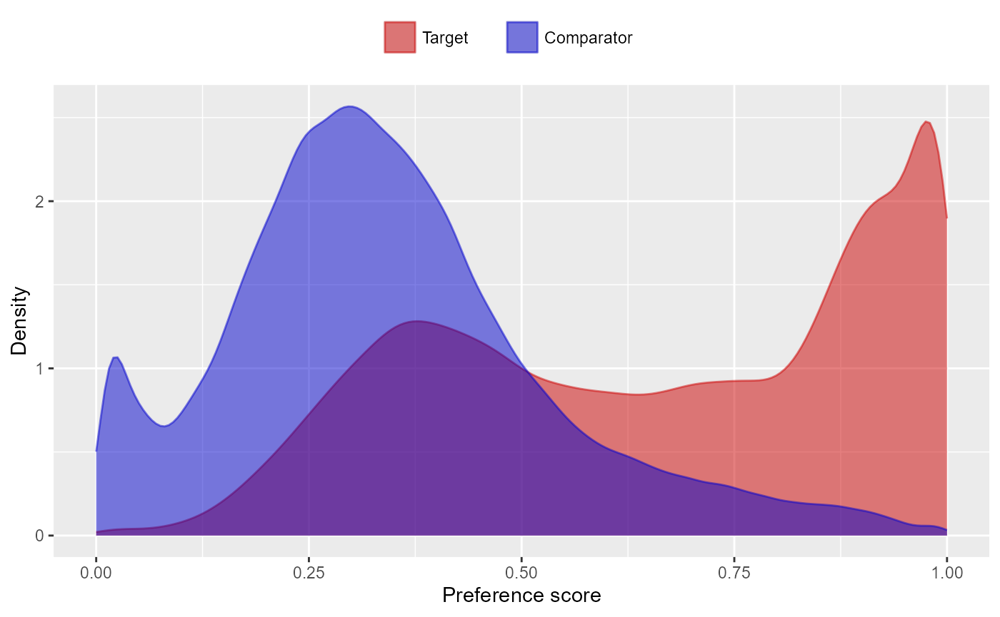

# Running multiple analyses at once using the CohortMethod package

## Introduction

In this vignette we focus on running several different analyses on
several target-comparator-(nesting)- outcome combinations. This can be
useful when we want to explore the sensitivity to analyses choices,
include controls, or run an experiment similar to the OMOP experiment to
empirically identify the optimal analysis choices for a particular
research question.

This vignette assumes you are already familiar with the `CohortMethod`
package and are able to perform single studies. We will walk through all
the steps needed to perform an exemplar set of analyses, and we have
selected the well-studied topic of the effect of coxibs versus
non-selective nonsteroidal anti-inflammatory drugs (NSAIDs) on
gastrointestinal (GI) bleeding-related hospitalization. For simplicity,
we focus on one coxib – celecoxib – and one non-selective NSAID –
diclofenac. We will execute various variations of an analysis for the
primary outcome and a large set of negative control outcomes.

## General approach

The general approach to running a set of analyses is that you specify
all the function arguments of the functions you would normally call, and
create sets of these function arguments. The final outcome models as
well as intermediate data objects will all be saved to disk for later
extraction.

An analysis will be executed by calling these functions in sequence:

1.  [`getDbCohortMethodData()`](https://ohdsi.github.io/CohortMethod/reference/getDbCohortMethodData.md)
2.  [`createStudyPopulation()`](https://ohdsi.github.io/CohortMethod/reference/createStudyPopulation.md)
3.  [`createPs()`](https://ohdsi.github.io/CohortMethod/reference/createPs.md)
    (optional)
4.  [`trimByPs()`](https://ohdsi.github.io/CohortMethod/reference/trimByPs.md)
    (optional)
5.  [`matchOnPs()`](https://ohdsi.github.io/CohortMethod/reference/matchOnPs.md)
    or
    [`stratifyByPs()`](https://ohdsi.github.io/CohortMethod/reference/stratifyByPs.md)
    (optional)
6.  [`computeCovariateBalance()`](https://ohdsi.github.io/CohortMethod/reference/computeCovariateBalance.md)
    (optional)
7.  [`fitOutcomeModel()`](https://ohdsi.github.io/CohortMethod/reference/fitOutcomeModel.md)
    (optional)

When you provide several analyses to the `CohortMethod` package, it will
determine whether any of the analyses have anything in common, and will
take advantage of this fact. For example, if we specify several analyses
that only differ in the way the outcome model is fitted, then
`CohortMethod` will extract the data and fit the propensity model only
once, and re-use this in all the analyses.

The function arguments you need to define have been divided into four
groups:

1.  **Hypothesis of interest**: arguments that are specific to a
    hypothesis of interest, in the case of the cohort method this is a
    combination of target, comparator, nesting cohort (optional) and
    outcome.
2.  **Analyses**: arguments that are not directly specific to a
    hypothesis of interest, such as the washout window, whether to
    include drugs as covariates, etc.
3.  Arguments that are the output of a previous function in the
    `CohortMethod` package, such as the `cohortMethodData` argument of
    the `createPs` function. These cannot be specified by the user.
4.  Arguments that are specific to an environment, such as the
    connection details for connecting to the server, and the name of the
    schema holding the CDM data.

There are a two arguments (`excludedCovariateConceptIds`, and
`includedCovariateConceptIds` of the `covariateSettings` argument of
[`getDbCohortMethodData()`](https://ohdsi.github.io/CohortMethod/reference/getDbCohortMethodData.md))
that can be argued to be part both of group 1 and 2. These arguments are
therefore present in both groups, and when executing the analysis the
union of the two lists of concept IDs will be used.

## Preparation for the example

We need to tell R how to connect to the server where the data are.
`CohortMethod` uses the `DatabaseConnector` package, which provides the
`createConnectionDetails` function. Type
[`?createConnectionDetails`](https://ohdsi.github.io/DatabaseConnector/reference/createConnectionDetails.html)
for the specific settings required for the various database management
systems (DBMS). For example, one might connect to a PostgreSQL database
using this code:

``` r
connectionDetails <- createConnectionDetails(dbms = "postgresql",
                                             server = "localhost/ohdsi",
                                             user = "joe",
                                             password = "supersecret")

cdmDatabaseSchema <- "my_cdm_data"
cohortDatabaseSchema <- "my_results"
cohortTable <- "my_cohorts"
options(sqlRenderTempEmulationSchema = NULL)
```

The last few lines define the `cdmDatabaseSchema`,
`cohortDatabaseSchema`, and `cohortTable` variables. We’ll use these
later to tell R where the data in CDM format live, and where we want to
write intermediate tables. Note that for Microsoft SQL Server,
databaseschemas need to specify both the database and the schema, so for
example `cdmDatabaseSchema <- "my_cdm_data.dbo"`. For database platforms
that do not support temp tables, such as Oracle, it is also necessary to
provide a schema where the user has write access that can be used to
emulate temp tables. PostgreSQL supports temp tables, so we can set
`options(sqlRenderTempEmulationSchema = NULL)` (or not set the
`sqlRenderTempEmulationSchema` at all.)

### Preparing the exposures and outcome(s)

We need to define the exposures and outcomes for our study. Here, we
will define our exposures using the OHDSI `Capr` package. We define two
exposure cohorts, one for celecoxib and one for diclofenac. It is often
a good idea to restrict your analysis to a specific indication, to
maximize the comparability of the two cohorts. In this case, we will
restrict to osteoarthritis of the knee. We will create a cohort for this
indication, starting a the first ever diagnosis, and ending at
observation period end.

``` r
library(Capr)

celecoxibConceptId <- 1118084
diclofenacConceptId <- 1124300
osteoArthritisOfKneeConceptId <- 4079750

celecoxib <- cs(
  descendants(celecoxibConceptId),
  name = "Celecoxib"
)

celecoxibCohort <- cohort(
  entry = entry(
    drugExposure(celecoxib)
  ),
  exit = exit(endStrategy = drugExit(celecoxib,
                                     persistenceWindow = 30,
                                     surveillanceWindow = 0))
)

diclofenac  <- cs(
  descendants(diclofenacConceptId),
  name = "Diclofenac"
)

diclofenacCohort <- cohort(
  entry = entry(
    drugExposure(diclofenac)
  ),
  exit = exit(endStrategy = drugExit(diclofenac,
                                     persistenceWindow = 30,
                                     surveillanceWindow = 0))
)

osteoArthritisOfKnee <- cs(
  descendants(osteoArthritisOfKneeConceptId),
  name = "Osteoarthritis of knee"
)

osteoArthritisOfKneeCohort <- cohort(
  entry = entry(
    conditionOccurrence(osteoArthritisOfKnee, firstOccurrence())
  ),
  exit = exit(
    endStrategy = observationExit()
  )
)
# Note: this will automatically assign cohort IDs 1,2, and 3, respectively:
exposuresAndIndicationCohorts <- makeCohortSet(celecoxibCohort, 
                                               diclofenacCohort, 
                                               osteoArthritisOfKneeCohort)
```

We’ll pull the outcome definition from the OHDSI `PhenotypeLibrary`:

``` r
library(PhenotypeLibrary)
outcomeCohorts <- getPlCohortDefinitionSet(77) # GI bleed
```

In addition to the outcome of interest, we also want to include a large
set of negative control outcomes. For simplicity we define each negative
control as a concept and all of its descendants:

``` r
negativeControlIds <- c(29735, 140673, 197494,
                        198185, 198199, 200528, 257315,
                        314658, 317376, 321319, 380731,
                        432661, 432867, 433516, 433701,
                        433753, 435140, 435459, 435524,
                        435783, 436665, 436676, 442619,
                        444252, 444429, 4131756, 4134120,
                        4134454, 4152280, 4165112, 4174262,
                        4182210, 4270490, 4286201, 4289933)
negativeControlCohorts <- tibble(
  cohortId = negativeControlIds,
  cohortName = sprintf("Negative control %d", negativeControlIds),
  outcomeConceptId = negativeControlIds
)
```

We combine the exposure, indication and outcome cohort definitions, and
use `CohortGenerator` to generate the cohorts:

``` r
library(CohortGenerator)
allCohorts <- bind_rows(outcomeCohorts,
                        exposuresAndIndicationCohorts)
cohortTableNames <- getCohortTableNames(cohortTable = cohortTable)
createCohortTables(connectionDetails = connectionDetails,
                   cohortDatabaseSchema = cohortDatabaseSchema,
                   cohortTableNames = cohortTableNames)
generateCohortSet(connectionDetails = connectionDetails,
                  cdmDatabaseSchema = cdmDatabaseSchema,
                  cohortDatabaseSchema = cohortDatabaseSchema,
                  cohortTableNames = cohortTableNames,
                  cohortDefinitionSet = allCohorts)
generateNegativeControlOutcomeCohorts(connectionDetails = connectionDetails,
                                      cdmDatabaseSchema = cdmDatabaseSchema,
                                      cohortDatabaseSchema = cohortDatabaseSchema,
                                      cohortTableNames  = cohortTableNames,
                                      negativeControlOutcomeCohortSet = negativeControlCohorts)
```

If all went well, we now have a table with the cohorts of interest. We
can see how many entries per cohort:

``` r
connection <- DatabaseConnector::connect(connectionDetails)
sql <- "SELECT cohort_definition_id, COUNT(*) AS count
FROM @cohortDatabaseSchema.@cohortTable
GROUP BY cohort_definition_id"
DatabaseConnector::renderTranslateQuerySql(
  connection = connection,
  sql = sql,
  cohortDatabaseSchema = cohortDatabaseSchema,
  cohortTable = cohortTable
  )
DatabaseConnector::disconnect(connection)
```

    ##    cohort_definition_id    count
    ## 1                433701    90997
    ## 2                435783   178528
    ## 3                380731   106693
    ## 4               4134120    51817
    ## 5                433516   236503
    ## 6                197494   114327
    ## 7                432867 37075900
    ## 8                436665   717207
    ## 9                432661      990
    ## 10               436676   431672
    ## 11              4152280  2125215
    ## 12               257315   982236
    ## 13               200528   979211
    ## 14               444429   170621
    ## 15               433753   496482
    ## 16               435524   356849
    ## 17               442619     1036
    ## 18              4134454    17972
    ## 19               435459   155207
    ## 20               317376    74848
    ## 21               314658  3305406
    ## 22                29735   324877
    ## 23               198199   215692
    ## 24              4182210  4430749
    ## 25              4174262  1332706
    ## 26              4286201   216303
    ## 27               140673  8957971
    ## 28                    2   993116
    ## 29                    1   917230
    ## 30               321319  1337722
    ## 31                   77  1123643
    ## 32                    3  1791695

## Specifying hypotheses of interest

The first group of arguments define the target, comparator,
nesting(optional), and outcome. Here we demonstrate how to create one
set, and add that set to a list:

``` r
outcomeOfInterest <- createOutcome(outcomeId = 77,
                                   outcomeOfInterest = TRUE)
negativeControlOutcomes <- lapply(
  negativeControlIds,
  function(outcomeId) createOutcome(outcomeId = outcomeId,
                                    outcomeOfInterest = FALSE,
                                    trueEffectSize = 1)
)
tcos <- createTargetComparatorOutcomes(
  targetId = 1,
  comparatorId = 2,
  nestingCohortId = 3,
  outcomes = append(list(outcomeOfInterest),
                    negativeControlOutcomes),
  excludedCovariateConceptIds = c(1118084, 1124300)
)
targetComparatorOutcomesList <- list(tcos)
```

We first define the outcome of interest (GI-bleed, cohort ID 77),
explicitly stating this is an outcome of interest
(`outcomeOfInterest = TRUE`), meaning we want the full set of artifacts
generated for this outcome. We then create a set of negative control
outcomes. Because we specify `outcomeOfInterest = FALSE`, many of the
artifacts will not be saved (like the matched population), or even not
generated at all (like the covariate balance). This can save a lot of
compute time and disk space. We also provide the true effect size for
these controls, which will be used later for empirical calibration. We
set the target to be celecoxib (cohort ID 1), the comparator to be
diclofenac (cohort ID 2), and the nesting cohort to osteoarthritis of
the knee (cohort ID 3).

A convenient way to save `targetComparatorOutcomesList` to file is by
using the `saveTargetComparatorOutcomesList` function, and we can load
it again using the `loadTargetComparatorOutcomesList` function.

## Specifying analyses

The second group of arguments are not specific to a hypothesis of
interest, and comprise the majority of arguments. You can recognize
these arguments because they are created by a separate ‘create…Args’
function. For example, for the `gtDbCohortMethodData()` function there
is the
[`createGetDbCohortMethodDataArgs()`](https://ohdsi.github.io/CohortMethod/reference/createGetDbCohortMethodDataArgs.md)
function. These settings functions can be used to create the arguments
to be used during execution:

``` r
covarSettings <- createDefaultCovariateSettings(
  addDescendantsToExclude = TRUE
)

getDbCmDataArgs <- createGetDbCohortMethodDataArgs(
  removeDuplicateSubjects = "keep first, truncate to second",
  firstExposureOnly = TRUE,
  washoutPeriod = 183,
  restrictToCommonPeriod = TRUE,
  covariateSettings = covarSettings
)

createStudyPopArgs <- createCreateStudyPopulationArgs(
  removeSubjectsWithPriorOutcome = TRUE,
  minDaysAtRisk = 1,
  riskWindowStart = 0,
  startAnchor = "cohort start",
  riskWindowEnd = 30,
  endAnchor = "cohort end"
)

fitOutcomeModelArgs1 <- createFitOutcomeModelArgs(
  modelType = "cox"
)
```

Note that, when calling `createDefaultCovariateSettings()`, we do not
specify the covariates to exclude. When running the analysis,
`CohortMethod` will automatically add the `excludedCovariateConceptIds`
specified earlier when calling
[`createTargetComparatorOutcomes()`](https://ohdsi.github.io/CohortMethod/reference/createTargetComparatorOutcomes.md).
This allows the same analyses settings to be used for multiple TCOs.

Any argument that is not explicitly specified by the user will assume
the default value specified in the function. We can now combine the
arguments for the various functions into a single analysis:

``` r
cmAnalysis1 <- createCmAnalysis(
  analysisId = 1,
  description = "No matching, simple outcome model",
  getDbCohortMethodDataArgs = getDbCmDataArgs,
  createStudyPopulationArgs = createStudyPopArgs,
  fitOutcomeModelArgs = fitOutcomeModelArgs1
)
```

Note that we have assigned an analysis ID (1) to this set of arguments.
We can use this later to link the results back to this specific set of
choices. We also include a short description of the analysis.

We can easily create more analyses, for example by using matching,
stratification, inverse probability of treatment weighting, or by using
more sophisticated outcome models:

``` r
createPsArgs <- createCreatePsArgs() # Use default settings only

matchOnPsArgs <- createMatchOnPsArgs(
  maxRatio = 100
)

computeSharedCovBalArgs <- createComputeCovariateBalanceArgs()

computeCovBalArgs <- createComputeCovariateBalanceArgs(
  covariateFilter = CohortMethod::getDefaultCmTable1Specifications()
)

fitOutcomeModelArgs2 <- createFitOutcomeModelArgs(
  modelType = "cox",
  stratified = TRUE
)

cmAnalysis2 <- createCmAnalysis(
  analysisId = 2,
  description = "Matching",
  getDbCohortMethodDataArgs = getDbCmDataArgs,
  createStudyPopulationArgs = createStudyPopArgs,
  createPsArgs = createPsArgs,
  matchOnPsArgs = matchOnPsArgs,
  computeSharedCovariateBalanceArgs = computeSharedCovBalArgs,
  computeCovariateBalanceArgs = computeCovBalArgs,
  fitOutcomeModelArgs = fitOutcomeModelArgs2
)

stratifyByPsArgs <- createStratifyByPsArgs(
  numberOfStrata = 10
)

cmAnalysis3 <- createCmAnalysis(
  analysisId = 3,
  description = "Stratification",
  getDbCohortMethodDataArgs = getDbCmDataArgs,
  createStudyPopulationArgs = createStudyPopArgs,
  createPsArgs = createPsArgs,
  stratifyByPsArgs = stratifyByPsArgs,
  computeSharedCovariateBalanceArgs = computeSharedCovBalArgs,
  computeCovariateBalanceArgs = computeCovBalArgs,
  fitOutcomeModelArgs = fitOutcomeModelArgs2
)

truncateIptwArgs <- createTruncateIptwArgs(
  maxWeight = 10
)

fitOutcomeModelArgs3 <- createFitOutcomeModelArgs(
  modelType = "cox",
  inversePtWeighting = TRUE,
  bootstrapCi = TRUE
)

cmAnalysis4 <- createCmAnalysis(
  analysisId = 4,
  description = "Inverse probability weighting",
  getDbCohortMethodDataArgs = getDbCmDataArgs,
  createStudyPopulationArgs = createStudyPopArgs,
  createPsArgs = createPsArgs,
  truncateIptwArgs = truncateIptwArgs,
  computeSharedCovariateBalanceArgs = computeSharedCovBalArgs,
  computeCovariateBalanceArgs = computeCovBalArgs,
  fitOutcomeModelArgs = fitOutcomeModelArgs3
)

fitOutcomeModelArgs4 <- createFitOutcomeModelArgs(
  useCovariates = TRUE,
  modelType = "cox",
  stratified = TRUE
)

cmAnalysis5 <- createCmAnalysis(
  analysisId = 5,
  description = "Matching plus full outcome model",
  getDbCohortMethodDataArgs = getDbCmDataArgs,
  createStudyPopulationArgs = createStudyPopArgs,
  createPsArgs = createPsArgs,
  matchOnPsArgs = matchOnPsArgs,
  computeSharedCovariateBalanceArgs = computeSharedCovBalArgs,
  computeCovariateBalanceArgs = computeCovBalArgs,
  fitOutcomeModelArgs = fitOutcomeModelArgs4
)

interactionCovariateIds <- c(8532001, 201826210, 21600960413) # Female, T2DM, concurent use of antithrombotic agents

fitOutcomeModelArgs5 <- createFitOutcomeModelArgs(
  modelType = "cox",
  stratified = TRUE,
  interactionCovariateIds = interactionCovariateIds
)

cmAnalysis6 <- createCmAnalysis(
  analysisId = 6,
  description = "Stratification plus interaction terms",
  getDbCohortMethodDataArgs = getDbCmDataArgs,
  createStudyPopulationArgs = createStudyPopArgs,
  createPsArgs = createPsArgs,
  stratifyByPsArgs = stratifyByPsArgs,
  computeSharedCovariateBalanceArgs = computeSharedCovBalArgs,
  computeCovariateBalanceArgs = computeCovBalArgs,
  fitOutcomeModelArgs = fitOutcomeModelArgs5
)
```

These analyses can be combined in a list:

``` r
cmAnalysisList <- list(cmAnalysis1, 
                       cmAnalysis2, 
                       cmAnalysis3, 
                       cmAnalysis4, 
                       cmAnalysis5, 
                       cmAnalysis6)
```

A convenient way to save `cmAnalysisList` to file is by using the
`saveCmAnalysisList` function, and we can load it again using the
`loadCmAnalysisList` function.

### Covariate balance

In our code, we specified that covariate balance must be computed for
some of our analysis. For computational reasons, covariate balance has
been split into two: We can compute covariate balance for each
target-comparator-outcome-analysis combination, and we can compute
covariate balance for each target-comparator-analysis, so across all
outcomes. The latter is referred to as ‘shared covariate balance’. Since
there can be many outcomes, it is often not feasible to recompute (or
store) balance for all covariates for each outcome. Moreover, the
differences between study populations for the various outcomes are
likely very small; the only differences will arise from removing those
having the outcome prior, which will exclude different people from the
study population depending on the outcome. We therefore typically
compute the balance for all covariates across all outcomes (shared
balance), and only for a small subset of covariates for each outcome. In
the code above, we use all covariates for the shared balance
computation, which we typically use to evaluate whether our analysis
achieved covariate balance. We limit the covariates for the per-outcome
balance computations to only those used for the standard ‘table 1’
definition used in the
[`getDefaultCmTable1Specifications()`](https://ohdsi.github.io/CohortMethod/reference/getDefaultCmTable1Specifications.md)
function, which we can use to create a ‘table 1’ for each outcome.

## Executing multiple analyses

We can now run the analyses against the hypotheses of interest using the
[`runCmAnalyses()`](https://ohdsi.github.io/CohortMethod/reference/runCmAnalyses.md)
function. This function will run all specified analyses against all
hypotheses of interest, meaning that the total number of outcome models
is `length(cmAnalysisList) * length(targetComparatorOutcomesList)` (if
all analyses specify an outcome model should be fitted). Note that we do
not want all combinations of analyses and hypothesis to be computed, we
can can skip certain analyses by using the `analysesToExclude` argument
of the
[`runCmAnalyses()`](https://ohdsi.github.io/CohortMethod/reference/runCmAnalyses.md).

``` r
multiThreadingSettings <- createDefaultMultiThreadingSettings(parallel::detectCores())

result <- runCmAnalyses(
  connectionDetails = connectionDetails,
  cdmDatabaseSchema = cdmDatabaseSchema,
  exposureDatabaseSchema = cohortDatabaseSchema,
  exposureTable = cohortTable,
  outcomeDatabaseSchema = cohortDatabaseSchema,
  outcomeTable = cohortTable,
  nestingCohortDatabaseSchema = cohortDatabaseSchema,
  nestingCohortTable = cohortTable,
  outputFolder = folder,
  multiThreadingSettings = multiThreadingSettings,
  cmAnalysesSpecifications = createCmAnalysesSpecifications(
    cmAnalysisList = cmAnalysisList,
    targetComparatorOutcomesList = targetComparatorOutcomesList
  )
)
```

In the code above, we first specify how many parallel threads
`CohortMethod` can use. Many of the computations can be computed in
parallel, and providing more than one CPU core can greatly speed up the
computation. Here we specify `CohortMethod` can use all the CPU cores
detected in the system (using the
[`parallel::detectCores()`](https://rdrr.io/r/parallel/detectCores.html)
function).

We call
[`runCmAnalyses()`](https://ohdsi.github.io/CohortMethod/reference/runCmAnalyses.md),
providing the arguments for connecting to the database, which schemas
and tables to use, as well as the analyses and hypotheses of interest.
The `folder` specifies where the outcome models and intermediate files
will be written.

### Restarting

If for some reason the execution was interrupted, you can restart by
re-issuing the
[`runCmAnalyses()`](https://ohdsi.github.io/CohortMethod/reference/runCmAnalyses.md)
command. Any intermediate and final products that have already been
completed and written to disk will be skipped.

## Retrieving the results

The result of the
[`runCmAnalyses()`](https://ohdsi.github.io/CohortMethod/reference/runCmAnalyses.md)
is a data frame with one row per target-target-outcome-analysis
combination. It provides the file names of the intermediate and
end-result files that were constructed. For example, we can retrieve and
plot the propensity scores for the combination of our target,
comparator, outcome of interest, and last analysis:

``` r
psFile <- result |>
  filter(targetId == 1,
         comparatorId == 2,
         outcomeId == 77,
         analysisId == 5) |>
  pull(psFile)
ps <- readRDS(file.path(folder, psFile))
plotPs(ps)
```



Note that some of the file names will appear several times in the table.
For example, analysis 3 and 5 only differ in terms of the outcome model,
and will share the same propensity score and stratification files.

We can always retrieve the file reference table again using the
[`getFileReference()`](https://ohdsi.github.io/CohortMethod/reference/getFileReference.md)
function:

``` r
result <- getFileReference(folder)
```

We can get a summary of the results using
[`getResultsSummary()`](https://ohdsi.github.io/CohortMethod/reference/getResultsSummary.md):

``` r
resultsSum <- getResultsSummary(folder)
resultsSum
```

    ## # A tibble: 216 × 27
    ##    analysisId targetId comparatorId nestingCohortId outcomeId targetSubjects
    ##         <int>    <int>        <int>           <int>     <int>          <int>
    ##  1          1        1            2               3        77          86201
    ##  2          1        1            2               3     29735          88336
    ##  3          1        1            2               3    140673          83134
    ##  4          1        1            2               3    197494          89155
    ##  5          1        1            2               3    198185          89318
    ##  6          1        1            2               3    198199          88806
    ##  7          1        1            2               3    200528          88682
    ##  8          1        1            2               3    257315          88328
    ##  9          1        1            2               3    314658          79863
    ## 10          1        1            2               3    317376          89190
    ## # ℹ 206 more rows
    ## # ℹ 21 more variables: comparatorSubjects <int>, targetDays <dbl>,
    ## #   comparatorDays <dbl>, targetOutcomes <dbl>, comparatorOutcomes <dbl>,
    ## #   rr <dbl>, ci95Lb <dbl>, ci95Ub <dbl>, p <dbl>, oneSidedP <dbl>,
    ## #   logRr <dbl>, seLogRr <dbl>, llr <dbl>, calibratedRr <dbl>,
    ## #   calibratedCi95Lb <dbl>, calibratedCi95Ub <dbl>, calibratedP <dbl>,
    ## #   calibratedOneSidedP <dbl>, calibratedLogRr <dbl>, …

This tells us, per target-comparator-outcome-analysis combination, the
estimated relative risk and 95% confidence interval, as well as the
number of people in the treated and comparator group (after trimming and
matching if applicable), and the number of outcomes observed for those
groups within the specified risk windows.

### Diagnostics

`CohorMethod` will have automatically executed a set of diagnostics for
each target-comparator-(nesting)-outcome:

- **Equipoise**: Pass if the equipoise is greater than 0.2, meaning the
  two cohorts are sufficiently comparable even before PS adjustment.
- **Balance**: Pass if the absolute standardized difference of means of
  all covariates is smaller than 0.1. We compute balance for both the
  shared balance (across all outcomes), and the per-outcome balance
  (which often only contains a small subset of covariates), and only
  pass if we pass for both.
- **Generalizability**: Pass if the standardized difference of means
  when comparing the analytic cohorts (e.g. after PS matching) to the
  original cohorts is smaller than some threshold for all covariates. We
  currently don’t set a threshold for this diagnostic, as we believe
  even less generalizable findings can still be meaningful.
- **Systematic error**: Pass is the expected absolute systematic error
  (EASE) is smaller than 0.25. EASE is computed by first fitting a
  normal distribution to the negative control estimates, and then
  integrating over the absolute value of this distribution. If EASE
  equals 0, all variation in negative control estimates can be explained
  by random error (as expressed in the confidence intervals) alone.
  Higher EASE scores indicate there is systematic error.
- **Power**: Pass if the minimum detectable relative risk is smaller
  than 10; We do not show estimates that have extremely low power
  because many people have trouble interpreting very wide confidence
  intervals. Underpowered estimates do still contribute to calibration,
  and when running across multiple databases, to the meta-analysis.

These diagnostics rely in threshold that can be specified using the
[`createCmDiagnosticThresholds()`](https://ohdsi.github.io/CohortMethod/reference/createCmDiagnosticThresholds.md),
which can be used in the
[`createCmAnalysesSpecifications()`](https://ohdsi.github.io/CohortMethod/reference/createCmAnalysesSpecifications.md)
when invoking
[`runCmAnalyses()`](https://ohdsi.github.io/CohortMethod/reference/runCmAnalyses.md).

Note that we are moving to balance diagnostic based on significance
testing to avoid failing the balance diagnostics on smaller data sets.
Currently the default is still to use the traditional balance approach.

We can retrieve the diagnostics:

``` r
diagnostics <- getDiagnosticsSummary(folder)
diagnostics
```

    ## # A tibble: 216 × 21
    ##    analysisId targetId comparatorId nestingCohortId outcomeId maxSdm
    ##         <int>    <int>        <int>           <int>     <int>  <dbl>
    ##  1          1        1            2               3        77     NA
    ##  2          1        1            2               3     29735     NA
    ##  3          1        1            2               3    140673     NA
    ##  4          1        1            2               3    197494     NA
    ##  5          1        1            2               3    198185     NA
    ##  6          1        1            2               3    198199     NA
    ##  7          1        1            2               3    200528     NA
    ##  8          1        1            2               3    257315     NA
    ##  9          1        1            2               3    314658     NA
    ## 10          1        1            2               3    317376     NA
    ## # ℹ 206 more rows
    ## # ℹ 15 more variables: sdmFamilyWiseMinP <dbl>, balanceDiagnostic <chr>,
    ## #   sharedMaxSdm <dbl>, sharedSdmFamilyWiseMinP <dbl>,
    ## #   sharedBalanceDiagnostic <chr>, equipoise <dbl>, equipoiseDiagnostic <chr>,
    ## #   generalizabilityMaxSdm <dbl>, generalizabilityDiagnostic <chr>, mdrr <dbl>,
    ## #   mdrrDiagnostic <chr>, ease <dbl>, easeDiagnostic <chr>,
    ## #   unblindForEvidenceSynthesis <lgl>, unblind <lgl>

The ‘unblind’ column tells us whether we have passed all diagnostics. We
can see for how many TCOs we pass diagnostics per analyses:

``` r
diagnostics |>
  group_by(analysisId) |>
  summarise(passing = sum(unblind))
```

    ## # A tibble: 6 × 2
    ##   analysisId passing
    ##        <int>   <int>
    ## 1          1       0
    ## 2          2      27
    ## 3          3       0
    ## 4          4       0
    ## 5          5      27
    ## 6          6       0

Here we see we pass diagnostics for many outcomes (including the
negative controls) for both analyses using matching, but fail for all
others. We can drill down into the diagnostics why this is (in this case
we fail because we don’t achieve covariate balance).

### Empirical calibration and negative control distribution

Because our study included negative control outcomes, our analysis
summary also contains calibrated confidence intervals and p-values. We
can also create the calibration effect plots for every analysis ID. In
each plot, the blue dots represent our negative control outcomes, and
the yellow diamond represents our health outcome of interest: GI bleed.
An unbiased, well-calibrated analysis should have 95% of the negative
controls between the dashed lines (ie. 95% should have p \> .05).

``` r
install.packages("EmpiricalCalibration")
library(EmpiricalCalibration)

# Analysis 1: No matching, simple outcome model
ncs <- resultsSum |>
  filter(analysisId == 1,
         outcomeId != 77)
hoi <- resultsSum |>
  filter(analysisId == 1,
         outcomeId == 77)
null <- fitNull(ncs$logRr, ncs$seLogRr)
plotCalibrationEffect(logRrNegatives = ncs$logRr, 
                      seLogRrNegatives = ncs$seLogRr, 
                      logRrPositives = hoi$logRr, 
                      seLogRrPositives = hoi$seLogRr, null)
```


``` r
# Analysis 2: Matching
ncs <- resultsSum |>
  filter(analysisId == 2,
         outcomeId != 77)
hoi <- resultsSum |>
  filter(analysisId == 2,
         outcomeId == 77)
null <- fitNull(ncs$logRr, ncs$seLogRr)
plotCalibrationEffect(logRrNegatives = ncs$logRr, 
                      seLogRrNegatives = ncs$seLogRr, 
                      logRrPositives = hoi$logRr, 
                      seLogRrPositives = hoi$seLogRr, null)
```


``` r
# Analysis 3: Stratification
ncs <- resultsSum |>
  filter(analysisId == 3,
         outcomeId != 77)
hoi <- resultsSum |>
  filter(analysisId == 3,
         outcomeId == 77)
null <- fitNull(ncs$logRr, ncs$seLogRr)
plotCalibrationEffect(logRrNegatives = ncs$logRr, 
                      seLogRrNegatives = ncs$seLogRr, 
                      logRrPositives = hoi$logRr, 
                      seLogRrPositives = hoi$seLogRr, null)
```


``` r
# Analysis 4: Inverse probability of treatment weighting
ncs <- resultsSum |>
  filter(analysisId == 4,
         outcomeId != 77)
hoi <- resultsSum |>
  filter(analysisId == 4,
         outcomeId == 77)
null <- fitNull(ncs$logRr, ncs$seLogRr)
plotCalibrationEffect(logRrNegatives = ncs$logRr, 
                      seLogRrNegatives = ncs$seLogRr, 
                      logRrPositives = hoi$logRr, 
                      seLogRrPositives = hoi$seLogRr, null)
```


``` r
# Analysis 5: Stratification plus full outcome model
ncs <- resultsSum |>
  filter(analysisId == 5,
         outcomeId != 77)
hoi <- resultsSum |>
  filter(analysisId == 5,
         outcomeId == 77)
null <- fitNull(ncs$logRr, ncs$seLogRr)
plotCalibrationEffect(logRrNegatives = ncs$logRr, 
                      seLogRrNegatives = ncs$seLogRr, 
                      logRrPositives = hoi$logRr, 
                      seLogRrPositives = hoi$seLogRr, null)
```


Analysis 6 explored interactions with certain variables. The estimates
for these interaction terms are stored in a separate results summary. We
can examine whether these estimates are also consistent with the null.
In this example we consider the interaction with ‘concurrent use of
antithrombotic agents’ (covariate ID 21600960413):

``` r
interactionResultsSum <- getInteractionResultsSummary(folder)

# Analysis 6: Stratification plus interaction terms
ncs <- interactionResultsSum |>
  filter(analysisId == 6,
         interactionCovariateId == 21600960413,
         outcomeId != 77)
hoi <- interactionResultsSum |>
  filter(analysisId == 6,
         interactionCovariateId == 21600960413,
         outcomeId == 77)
null <- fitNull(ncs$logRr, ncs$seLogRr)
plotCalibrationEffect(logRrNegatives = ncs$logRr, 
                      seLogRrNegatives = ncs$seLogRr, 
                      logRrPositives = hoi$logRr, 
                      seLogRrPositives = hoi$seLogRr, null)
```

    ## Warning in fitNull(ncs$logRr, ncs$seLogRr): Estimate(s) with extreme logRr
    ## detected: abs(logRr) > log(100). Removing before fitting null distribution

    ## Warning in checkWithinLimits(yLimits, c(seLogRrNegatives, seLogRrPositives), :
    ## Values are outside plotted range. Consider adjusting yLimits parameter

    ## Warning in checkWithinLimits(log(xLimits), c(logRrNegatives, logRrPositives), :
    ## Values are outside plotted range. Consider adjusting xLimits parameter

    ## Warning: Removed 1 row containing missing values or values outside the scale range
    ## (`geom_vline()`).

    ## Warning: Removed 1 row containing missing values or values outside the scale range
    ## (`geom_point()`).


## Exporting to CSV

The results generated so far all reside in binary object on your local
file system, mixing aggregate statistics such as hazard ratios with
patient-level data including propensity scores per person. How could we
share our results with others, possibly outside our organization? This
is where the
[`exportToCsv()`](https://ohdsi.github.io/CohortMethod/reference/exportToCsv.md)
function comes in. This function exports all results, including
diagnostics to CSV (comma-separated values) files. These files only
contain aggregate statistics, not patient-level data. The format is CSV
files to enable human review.

``` r
exportToCsv(
  folder,
  exportFolder = file.path(folder, "export"),
  databaseId = "My CDM",
  minCellCount = 5,
  maxCores = parallel::detectCores()
)
```

Any person counts in the results that are smaller than the
`minCellCount` argument will be blinded, by replacing the count with the
negative `minCellCount`. For example, if the number of people with the
outcome is 3, and `minCellCount = 5`, the count will be reported to be
-5, which in the Shiny app will be displayed as ‘\<5’.

Information on the data model used to generate the CSV files can be
retrieved using
[`getResultsDataModelSpecifications()`](https://ohdsi.github.io/CohortMethod/reference/getResultsDataModelSpecifications.md):

``` r
getResultsDataModelSpecifications()
```

    ## # A tibble: 183 × 8
    ##    tableName   columnName dataType isRequired primaryKey minCellCount deprecated
    ##    <chr>       <chr>      <chr>    <chr>      <chr>      <chr>        <chr>     
    ##  1 cm_attriti… sequence_… int      Yes        Yes        No           No        
    ##  2 cm_attriti… descripti… varchar  Yes        No         No           No        
    ##  3 cm_attriti… subjects   int      Yes        No         Yes          No        
    ##  4 cm_attriti… exposure_… bigint   Yes        Yes        No           No        
    ##  5 cm_attriti… target_co… bigint   Yes        Yes        No           No        
    ##  6 cm_attriti… analysis_… int      Yes        Yes        No           No        
    ##  7 cm_attriti… outcome_id bigint   Yes        Yes        No           No        
    ##  8 cm_attriti… database_… varchar  Yes        Yes        No           No        
    ##  9 cm_follow_… target_co… bigint   Yes        Yes        No           No        
    ## 10 cm_follow_… outcome_id bigint   Yes        Yes        No           No        
    ## # ℹ 173 more rows
    ## # ℹ 1 more variable: description <chr>

## Acknowledgments

Considerable work has been dedicated to provide the `CohortMethod`
package.

``` r
citation("CohortMethod")
```

    ## To cite CohortMethod in publications use:
    ## 
    ##   Schuemie MJ, Reps JM, Black A, DeFalco F, Evans L, Fridgeirsson E,
    ##   Gilbert JP, Knoll C, Lavallee M, Rao G, Rijnbeek P, Sadowski K, Sena
    ##   A, Swerdel J, Williams RD, Suchard MA (2024). "Health-analytics data
    ##   to evidence suite (HADES): open-source software for observational
    ##   research." _Studies in Health Technology and Informatics_, *310*,
    ##   966-970. doi:10.3233/SHTI231108 <https://doi.org/10.3233/SHTI231108>,
    ##   <https://doi.org/10.3233/shti231108>.
    ## 
    ## A BibTeX entry for LaTeX users is
    ## 
    ##   @Article{,
    ##     title = {Health-analytics data to evidence suite (HADES): open-source software for observational research},
    ##     author = {M. J. Schuemie and J. M. Reps and A. Black and F. DeFalco and L. Evans and E. Fridgeirsson and J. P. Gilbert and C. Knoll and M. Lavallee and G. Rao and P. Rijnbeek and K. Sadowski and A. Sena and J. Swerdel and R. D. Williams and M. A. Suchard},
    ##     journal = {Studies in Health Technology and Informatics},
    ##     year = {2024},
    ##     volume = {310},
    ##     pages = {966-970},
    ##     doi = {10.3233/SHTI231108},
    ##     url = {https://doi.org/10.3233/shti231108},
    ##   }

Further, `CohortMethod` makes extensive use of the `Cyclops` package.

``` r
citation("Cyclops")
```

    ## To cite Cyclops in publications use:
    ## 
    ##   Suchard MA, Simpson SE, Zorych I, Ryan P, Madigan D (2013). "Massive
    ##   parallelization of serial inference algorithms for complex
    ##   generalized linear models." _ACM Transactions on Modeling and
    ##   Computer Simulation_, *23*, 10. doi:10.1145/2414416.2414791
    ##   <https://doi.org/10.1145/2414416.2414791>.
    ## 
    ## A BibTeX entry for LaTeX users is
    ## 
    ##   @Article{,
    ##     author = {M. A. Suchard and S. E. Simpson and I. Zorych and P. Ryan and D. Madigan},
    ##     title = {Massive parallelization of serial inference algorithms for complex generalized linear models},
    ##     journal = {ACM Transactions on Modeling and Computer Simulation},
    ##     volume = {23},
    ##     pages = {10},
    ##     year = {2013},
    ##     doi = {10.1145/2414416.2414791},
    ##   }

This work is supported in part through the National Science Foundation
grant IIS 1251151.
