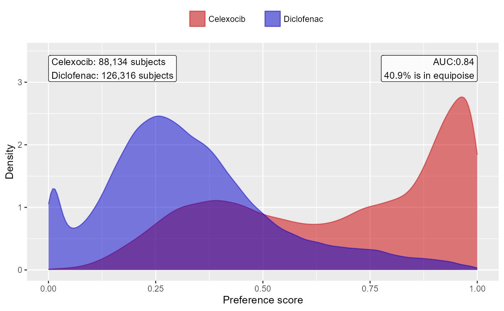
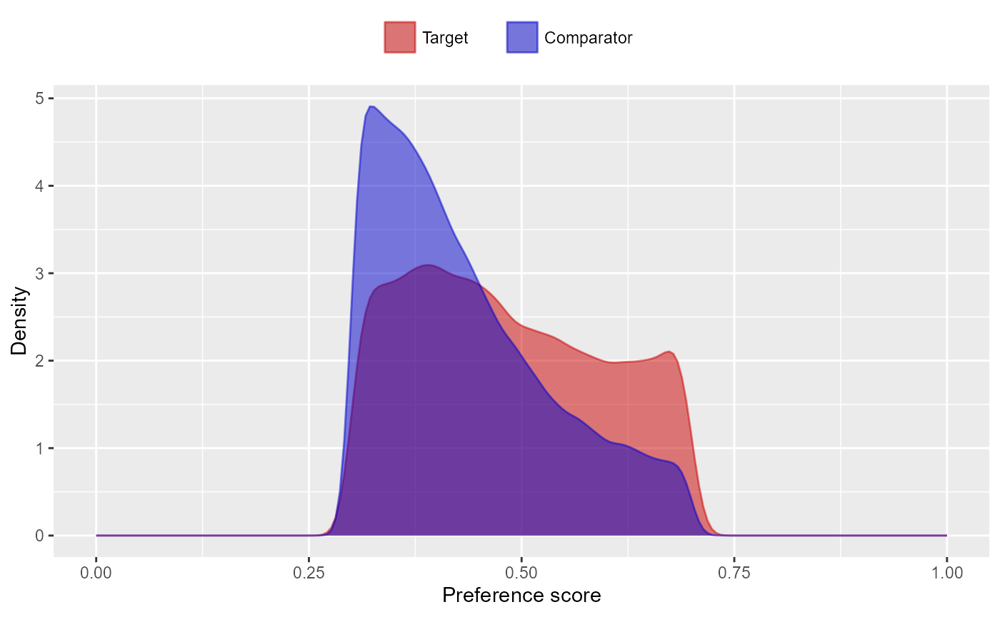
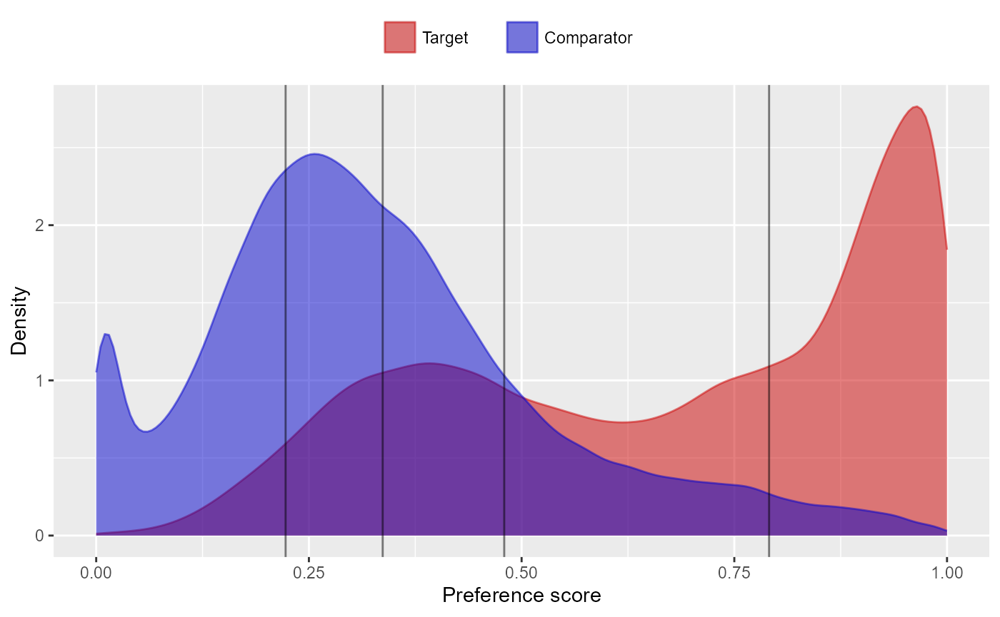
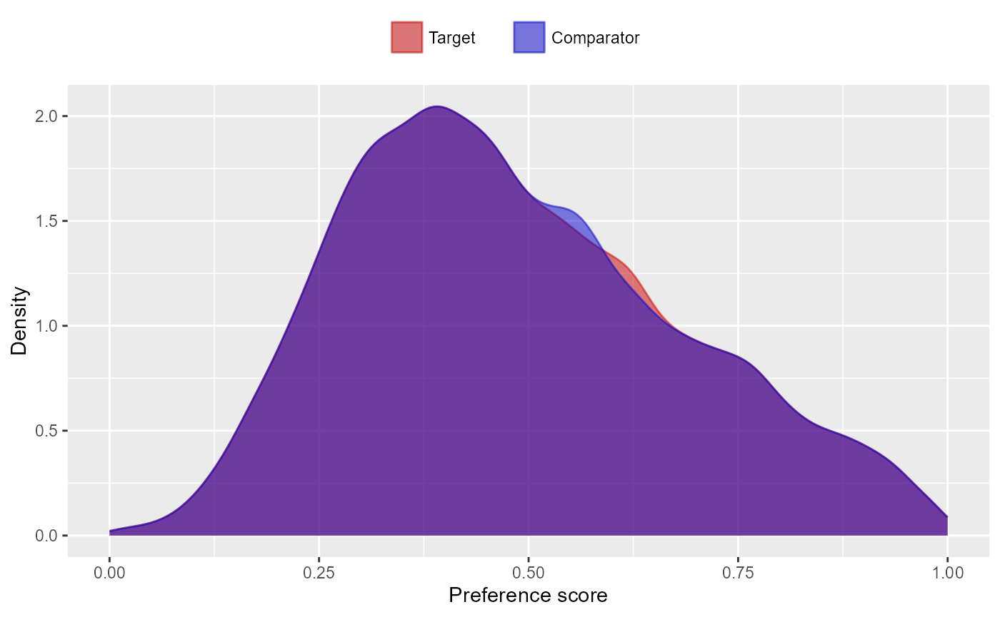
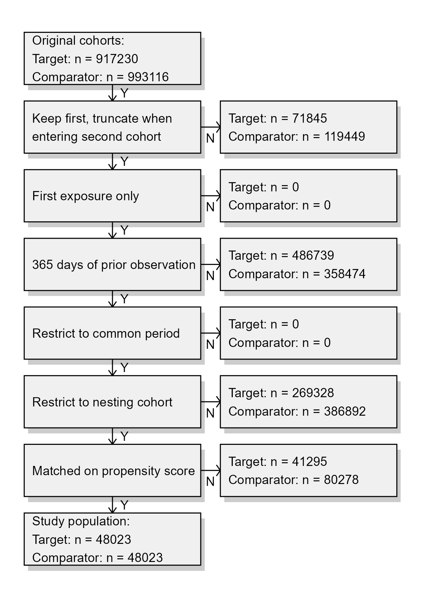
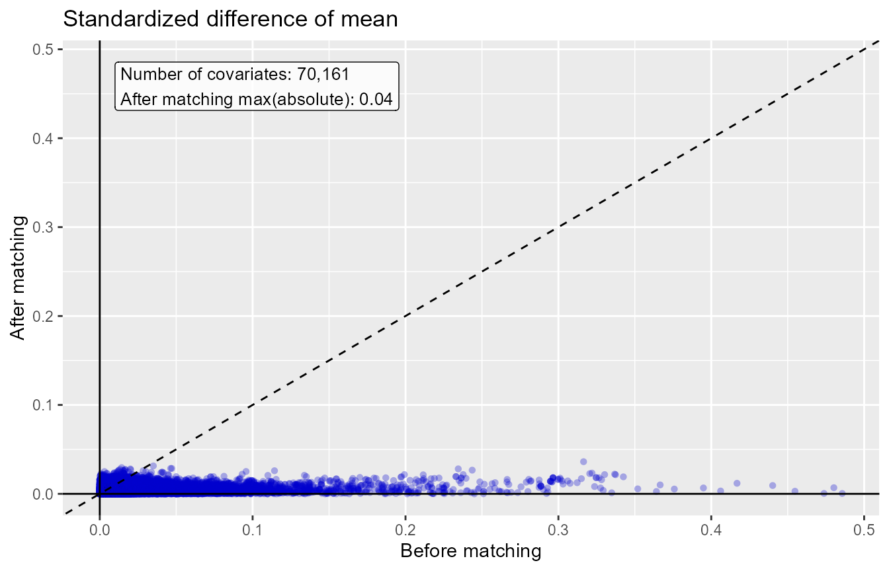
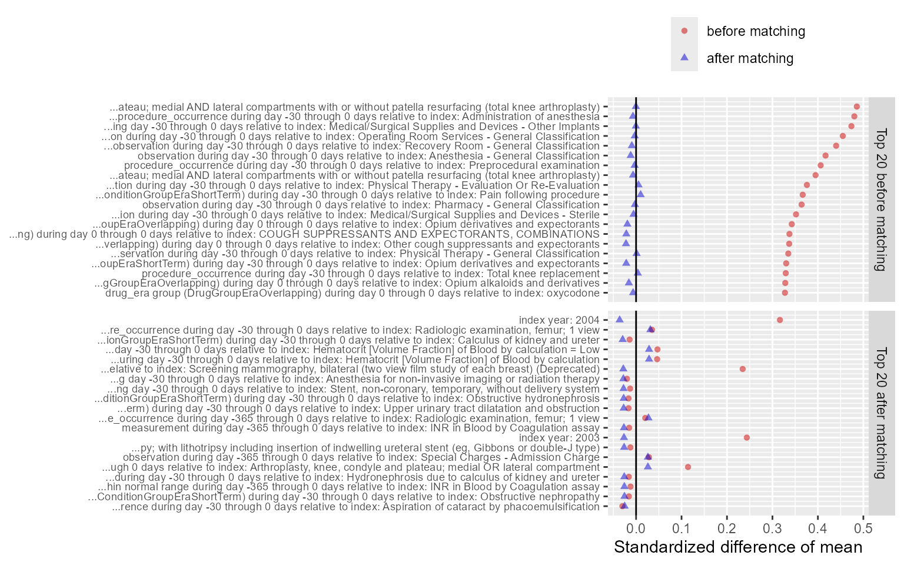
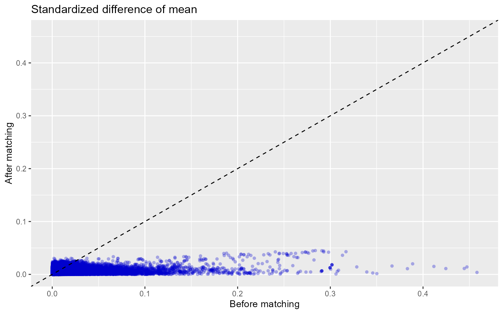
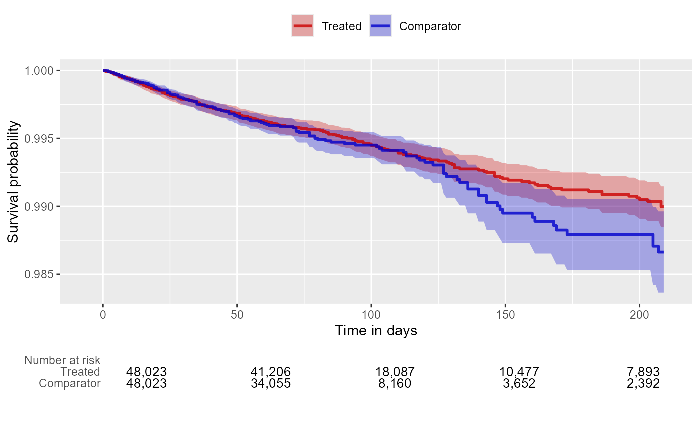
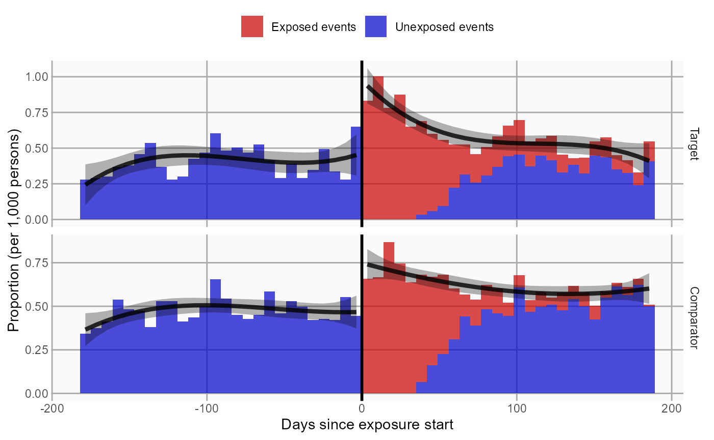

# Single studies using the CohortMethod package

## Introduction

This vignette describes how you can use the `CohortMethod` package to
perform a single new-user cohort study. We will walk through all the
steps needed to perform an exemplar study, and we have selected the
well-studied topic of the effect of coxibs versus non-selective
non-steroidal anti-inflammatory drugs (NSAIDs) on gastrointestinal (GI)
bleeding-related hospitalization. For simplicity, we focus on one coxib
– celecoxib – and one non-selective NSAID – diclofenac.

## Data extraction

The first step in running the `CohortMethod` is extracting all necessary
data from the database server holding the data in the Observational
Medical Outcomes Partnership (OMOP) Common Data Model (CDM) format.

### Configuring the connection to the server

We need to tell R how to connect to the server where the data are.
`CohortMethod` uses the `DatabaseConnector` package, which provides the
`createConnectionDetails` function. Type
[`?createConnectionDetails`](https://ohdsi.github.io/DatabaseConnector/reference/createConnectionDetails.html)
for the specific settings required for the various database management
systems (DBMS). For example, one might connect to a PostgreSQL database
using this code:

``` r
library(CohortMethod)
connectionDetails <- createConnectionDetails(dbms = "postgresql",
                                             server = "localhost/ohdsi",
                                             user = "joe",
                                             password = "supersecret")

cdmDatabaseSchema <- "my_cdm_data"
cohortDatabaseSchema <- "my_results"
cohortTable <- "my_cohorts"
options(sqlRenderTempEmulationSchema = NULL)
```

The last few lines define the `cdmDatabaseSchema`,
`cohortDatabaseSchema`, and `cohortTable` variables. We’ll use these
later to tell R where the data in CDM format live, and where we want to
write intermediate tables. Note that for Microsoft SQL Server,
databaseschemas need to specify both the database and the schema, so for
example `cdmDatabaseSchema <- "my_cdm_data.dbo"`. For database platforms
that do not support temp tables, such as Oracle, it is also necessary to
provide a schema where the user has write access that can be used to
emulate temp tables. PostgreSQL supports temp tables, so we can set
`options(sqlRenderTempEmulationSchema = NULL)` (or not set the
`sqlRenderTempEmulationSchema` at all.)

### Preparing the exposures and outcome(s)

We need to define the exposures and outcomes for our study. Here, we
will define our exposures using the OHDSI `Capr` package. We define two
exposure cohorts, one for celecoxib and one for diclofenac. It is often
a good idea to restrict your analysis to a specific indication, to
maximize the comparability of the two cohorts. In this case, we will
restrict to osteoarthritis of the knee. We will create a cohort for this
indication, starting a the first ever diagnosis, and ending at
observation period end.

``` r
library(Capr)

celecoxibConceptId <- 1118084
diclofenacConceptId <- 1124300
osteoArthritisOfKneeConceptId <- 4079750

celecoxib <- cs(
  descendants(celecoxibConceptId),
  name = "Celecoxib"
)

celecoxibCohort <- cohort(
  entry = entry(
    drugExposure(celecoxib)
  ),
  exit = exit(endStrategy = drugExit(celecoxib,
                                     persistenceWindow = 30,
                                     surveillanceWindow = 0))
)

diclofenac  <- cs(
  descendants(diclofenacConceptId),
  name = "Diclofenac"
)

diclofenacCohort <- cohort(
  entry = entry(
    drugExposure(diclofenac)
  ),
  exit = exit(endStrategy = drugExit(diclofenac,
                                     persistenceWindow = 30,
                                     surveillanceWindow = 0))
)

osteoArthritisOfKnee <- cs(
  descendants(osteoArthritisOfKneeConceptId),
  name = "Osteoarthritis of knee"
)

osteoArthritisOfKneeCohort <- cohort(
  entry = entry(
    conditionOccurrence(osteoArthritisOfKnee, firstOccurrence())
  ),
  exit = exit(
    endStrategy = observationExit()
  )
)
# Note: this will automatically assign cohort IDs 1,2, and 3, respectively:
exposuresAndIndicationCohorts <- makeCohortSet(celecoxibCohort, 
                                               diclofenacCohort, 
                                               osteoArthritisOfKneeCohort)
```

We’ll pull the outcome definition from the OHDSI `PhenotypeLibrary`:

``` r
library(PhenotypeLibrary)
outcomeCohorts <- getPlCohortDefinitionSet(77) # GI bleed
```

We combine the exposure and outcome cohort definitions, and use
`CohortGenerator` to generate the cohorts:

``` r
allCohorts <- bind_rows(outcomeCohorts,
                        exposuresAndIndicationCohorts)

library(CohortGenerator)
cohortTableNames <- getCohortTableNames(cohortTable = cohortTable)
createCohortTables(connectionDetails = connectionDetails,
                   cohortDatabaseSchema = cohortDatabaseSchema,
                   cohortTableNames = cohortTableNames)
generateCohortSet(connectionDetails = connectionDetails,
                  cdmDatabaseSchema = cdmDatabaseSchema,
                  cohortDatabaseSchema = cohortDatabaseSchema,
                  cohortTableNames = cohortTableNames,
                  cohortDefinitionSet = allCohorts)
```

If all went well, we now have a table with the cohorts of interest. We
can see how many entries per cohort:

``` r
connection <- DatabaseConnector::connect(connectionDetails)
sql <- "SELECT cohort_definition_id, COUNT(*) AS count
FROM @cohortDatabaseSchema.@cohortTable
GROUP BY cohort_definition_id"
cohortCounts <- DatabaseConnector::renderTranslateQuerySql(
  connection = connection,
  sql = sql,
  cohortDatabaseSchema = cohortDatabaseSchema,
  cohortTable = cohortTable
  )
DatabaseConnector::disconnect(connection)
```

    ##   cohort_concept_id   count
    ## 1                 1  917230
    ## 2                 2 1791695
    ## 3                 3  993116
    ## 4                77 1123643

### Extracting the data from the server

Now we can tell `CohortMethod` to extract the cohorts, construct
covariates, and extract all necessary data for our analysis.

**Important**: The target and comparator drug must not be included in
the covariates, including any descendant concepts. You will need to
manually add the drugs and descendants to the
`excludedCovariateConceptIds` of the covariate settings. In this example
code we exclude the concepts for celecoxib and diclofenac and specify
`addDescendantsToExclude = TRUE`:

``` r
# Define which types of covariates must be constructed:
covSettings <- createDefaultCovariateSettings(
  excludedCovariateConceptIds = c(diclofenacConceptId, celecoxibConceptId),
  addDescendantsToExclude = TRUE
)

#Load data:
cohortMethodData <- getDbCohortMethodData(
  connectionDetails = connectionDetails,
  cdmDatabaseSchema = cdmDatabaseSchema,
  targetId = 1,
  comparatorId = 2,
  outcomeIds = 77,
  exposureDatabaseSchema = cohortDatabaseSchema,
  exposureTable = cohortTable,
  outcomeDatabaseSchema = cohortDatabaseSchema,
  outcomeTable = cohortTable,
  nestingCohortDatabaseSchema = cohortDatabaseSchema,
  nestingCohortTable = cohortTable,
  getDbCohortMethodDataArgs = createGetDbCohortMethodDataArgs(
    removeDuplicateSubjects = "keep first, truncate to second",
    firstExposureOnly = TRUE,
    washoutPeriod = 365,
    restrictToCommonPeriod = TRUE,
    nestingCohortId = 3,
    covariateSettings = covSettings
  )
)
cohortMethodData
```

    ## # CohortMethodData object
    ## 
    ## Target cohort ID: 1
    ## Comparator cohort ID: 2
    ## Nesting cohort ID: 3
    ## Outcome cohort ID(s): 77
    ## 
    ## Inherits from CovariateData:
    ## # CovariateData object
    ## 
    ## All cohorts
    ## 
    ## Inherits from Andromeda:
    ## # Andromeda object
    ## # Physical location:  C:\Users\admin_mschuemi.EU\AppData\Local\Temp\2\RtmpKM2hKL\file9986f2f17e6.duckdb
    ## 
    ## Tables:
    ## $analysisRef (analysisId, analysisName, domainId, startDay, endDay, isBinary, missingMeansZero)
    ## $cohorts (rowId, personSeqId, personId, treatment, cohortStartDate, daysFromObsStart, daysToCohortEnd, daysToObsEnd)
    ## $covariateRef (covariateId, covariateName, analysisId, conceptId, valueAsConceptId, collisions)
    ## $covariates (rowId, covariateId, covariateValue)
    ## $outcomes (rowId, outcomeId, daysToEvent)

There are many parameters, but they are all documented in the
`CohortMethod` manual. The `createDefaultCovariateSettings` function is
described in the `FeatureExtraction` package. In short, we are pointing
the function to the table created earlier and indicating which concept
IDs in that table identify the target, comparator, nesting cohort and
outcome. We instruct that the default set of covariates should be
constructed, including covariates for all conditions, drug exposures,
and procedures that were found on or before the index date. To customize
the set of covariates, please refer to the `FeatureExtraction` package
vignette by typing
[`vignette("UsingFeatureExtraction", package="FeatureExtraction")`](https://cran.rstudio.com/web/packages/FeatureExtraction/vignettes/UsingFeatureExtraction.pdf).

We let the `CohortMethod` package construct our sets of new users: - For
those patients who have exposure to both the target and the comparator,
we keep whichever is their first, and truncate their exposure at the
start of the second (if the first occurrences of the target and
comparator start simultaneously the patient is removed). - We restrict
to the first exposure overall (in this case redundant with the previous
step). - We require a washout period of 365 days, meaning any patients
with less than 365 days of prior observation are removed. - We restrict
to the period in time when both drugs were observed in the database.
This can be especially helpful when one of the exposures is new to the
market. - We restrict to the nesting cohort, in this case our
indication. Only exposures within the nesting cohort are kept.

We can see how many persons and exposures were left after each of these
steps:

``` r
getAttritionTable(cohortMethodData)
```

    ##                       description targetPersons comparatorPersons targetExposures comparatorExposures
    ## 1                Original cohorts        917230            993116          917230              993116
    ## 2 Keep first, truncate when e ...        845385            873667          845385              873667
    ## 3             First exposure only        845385            873667          845385              873667
    ## 4 365 days of prior observati ...        358646            515193          358646              515193
    ## 5       Restrict to common period        358646            515193          358646              515193
    ## 6      Restrict to nesting cohort         89318            128301           89318              128301

The
`cohortMethodData() function extracts all data about the exposures, outcomes, and covariates from the server and stores them in the`cohortMethodData`object. This object uses the`Andromeda`package to store information in a way that ensures R does not run out of memory, even when the data are large. We can use the generic`summary()\`
function to view some more information of the data we extracted:

``` r
summary(cohortMethodData)
```

    ## CohortMethodData object summary
    ## 
    ## Target cohort ID: 1
    ## Comparator cohort ID: 2
    ## Nesting cohort ID: 3
    ## Outcome cohort ID(s): 77
    ## 
    ## Target persons: 89318
    ## Comparator persons: 128301
    ## 
    ## Outcome counts:
    ##    Event count Person count
    ## 77       37448        20123
    ## 
    ## Covariates:
    ## Number of covariates: 85838
    ## Number of non-zero covariate values: 111096472

#### Saving the data to file

Creating the `cohortMethodData` file can take considerable computing
time, and it is probably a good idea to save it for future sessions.
Because `cohortMethodData` uses `Andromeda`, we cannot use R’s regular
save function. Instead, we’ll have to use the
[`saveCohortMethodData()`](https://ohdsi.github.io/CohortMethod/reference/saveCohortMethodData.md)
function:

``` r
saveCohortMethodData(cohortMethodData, "coxibVsNonselVsGiBleed.zip")
```

We can use the
[`loadCohortMethodData()`](https://ohdsi.github.io/CohortMethod/reference/loadCohortMethodData.md)
function to load the data in a future session.

## Defining the study population

Typically, the exposure cohorts and outcome cohorts will be defined
independently of each other. When we want to produce an effect size
estimate, we need to further restrict these cohorts and put them
together, for example by removing exposed subjects that had the outcome
prior to exposure, and only keeping outcomes that fall within a defined
risk window. For this we can use the `createStudyPopulation` function:

``` r
studyPop <- createStudyPopulation(
  cohortMethodData = cohortMethodData,
  outcomeId = 77,
  createStudyPopulationArgs = createCreateStudyPopulationArgs(
    removeSubjectsWithPriorOutcome = TRUE,
    priorOutcomeLookback = 365,
    minDaysAtRisk = 1,
    riskWindowStart = 0,
    startAnchor = "cohort start",
    riskWindowEnd = 30,
    endAnchor = "cohort end"
  )
)
```

We specify the outcome ID we will use, and that people who had the
outcomes in the 365 days before the risk window start date will be
removed. The risk window is defined as starting at the cohort start date
(the index date, `riskWindowStart = 0` and
`startAnchor = "cohort start"`), and the risk windows ends 30 days after
the cohort ends (`riskWindowEnd = 30` and `endAnchor = "cohort end"`).
Note that the risk windows are truncated at the end of observation or
the study end date. We also remove subjects who have no time at risk. To
see how many people are left in the study population we can always use
the `getAttritionTable` function:

``` r
getAttritionTable(studyPop)
```

    ##                       description targetPersons comparatorPersons targetExposures comparatorExposures
    ## 1                Original cohorts        917230            993116          917230              993116
    ## 2 Keep first, truncate when e ...        845385            873667          845385              873667
    ## 3             First exposure only        845385            873667          845385              873667
    ## 4 365 days of prior observati ...        358646            515193          358646              515193
    ## 5       Restrict to common period        358646            515193          358646              515193
    ## 6      Restrict to nesting cohort         89318            128301           89318              128301
    ## 7                No prior outcome         88134            126316           88134              126316
    ## 8 Have at least 1 days at ris ...         88134            126316           88134              126316

## Propensity scores

The `CohortMethod` can use propensity scores to adjust for potential
confounders. Instead of the traditional approach of using a handful of
predefined covariates, `CohortMethod` typically uses tens of thousands
of covariates that are automatically constructed based on conditions,
procedures and drugs in the records of the subjects.

### Fitting a propensity model

We can fit a propensity model using the covariates constructed by the
`getDbcohortMethodData()` function:

``` r
ps <- createPs(cohortMethodData = cohortMethodData, population = studyPop)
```

The
[`createPs()`](https://ohdsi.github.io/CohortMethod/reference/createPs.md)
function uses the `Cyclops` package to fit a large-scale regularized
logistic regression.

To fit the propensity model, `Cyclops` needs to know the hyperparameter
value which specifies the variance of the prior. By default `Cyclops`
will use cross-validation to estimate the optimal hyperparameter.
However, be aware that this can take a really long time. You can use the
`prior` and `control` parameters of the
[`createPs()`](https://ohdsi.github.io/CohortMethod/reference/createPs.md)
to specify `Cyclops` behavior, including using multiple CPUs to speed-up
the cross-validation.

### Propensity score diagnostics

We can compute the area under the receiver-operator curve (AUC) for the
propensity score model:

``` r
computePsAuc(ps)
```

    ## [1] 0.8411435

We can also plot the propensity score distribution. By default, the
`plotPS()` function shows the preference score, a transformation of the
propensity score that adjusts for differences in sizes between the
target and comparator:

``` r
plotPs(ps,
       targetLabel = "Celexocib",
       comparatorLabel = "Diclofenac",
       showCountsLabel = TRUE,
       showAucLabel = TRUE,
       showEquipoiseLabel = TRUE)
```



It is also possible to inspect the propensity model itself by showing
the covariates that have non-zero coefficients:

``` r
getPsModel(ps, cohortMethodData)
```

    ## # A tibble: 6 × 3
    ##   coefficient covariateId covariateName                              
    ##         <dbl>       <dbl> <chr>                                      
    ## 1       -4.11  1150871413 ...gh 0 days relative to index: misoprostol
    ## 2        3.26     2001006 index year: 2001                           
    ## 3        3.14     2002006 index year: 2002                           
    ## 4        2.67     2003006 index year: 2003                           
    ## 5        2.38     2004006 index year: 2004                           
    ## 6        1.67     2007006 index year: 2007

One advantage of using the regularization when fitting the propensity
model is that most coefficients will shrink to zero and fall out of the
model. It is a good idea to inspect the remaining variables for anything
that should not be there, for example variations of the drugs of
interest that we forgot to exclude.

Finally, we can inspect the percent of the population in equipoise,
meaning they have a preference score between 0.3 and 0.7:

``` r
CohortMethod::computeEquipoise(ps)
```

    ## [1] 0.4090277

A low equipoise indicates there is little overlap between the target and
comparator populations.

### Using the propensity score

We can use the propensity scores to trim, stratify, match, or weigh our
population. For example, one could trim to equipoise, meaning only
subjects with a preference score between 0.3 and 0.7 are kept:

``` r
trimmedPop <- trimByPs(ps,
                       trimByPsArgs = createTrimByPsArgs(
                         equipoiseBounds = c(0.3, 0.7)
                       ))
# Note: we need to also provide the original PS object so the preference score
# is computed using the original relative sizes of the cohorts:
plotPs(trimmedPop, ps)
```

    ## Trimming removed 55955 (63.5%) rows from the target, 70779 (56.0%) rows from the comparator.



Instead (or additionally), we could stratify the population based on the
propensity score:

``` r
stratifiedPop <- stratifyByPs(ps, 
                              stratifyByPsArgs = createStratifyByPsArgs(
                                numberOfStrata = 5
                              ))
plotPs(stratifiedPop)
```



We can also match subjects based on propensity scores. In this example,
we’re using one-to-one matching. By default,
[`createPs()`](https://ohdsi.github.io/CohortMethod/reference/createPs.md)
will use a caliper of 0.2 on the standardized logit scale:

``` r
matchedPop <- matchOnPs(ps,
                        matchOnPsArgs = createMatchOnPsArgs(
                          maxRatio = 1
                        ))
plotPs(matchedPop, ps)
```

    ## Population size after matching is 96046



We can see the effect of trimming and/or matching on the population
using the `getAttritionTable` function:

``` r
getAttritionTable(matchedPop)
```

    ##                       description targetPersons comparatorPersons targetExposures comparatorExposures
    ## 1                Original cohorts        917230            993116          917230              993116
    ## 2 Keep first, truncate when e ...        845385            873667          845385              873667
    ## 3             First exposure only        845385            873667          845385              873667
    ## 4 365 days of prior observati ...        358646            515193          358646              515193
    ## 5       Restrict to common period        358646            515193          358646              515193
    ## 6      Restrict to nesting cohort         89318            128301           89318              128301
    ## 7     Matched on propensity score         48023             48023           48023               48023

Or, if we like, we can plot an attrition diagram:

``` r
drawAttritionDiagram(matchedPop)
```



### Evaluating covariate balance

To evaluate whether our use of the propensity score is indeed making the
two cohorts more comparable, we can compute the covariate balance before
and after trimming, matching, and/or stratifying:

``` r
balance <- computeCovariateBalance(matchedPop, cohortMethodData)
```

``` r
plotCovariateBalanceScatterPlot(balance, 
                                showCovariateCountLabel = TRUE, 
                                showMaxLabel = TRUE)
```



``` r
plotCovariateBalanceOfTopVariables(balance)
```



The ‘before matching’ population is the population as extracted by the
`getDbCohortMethodData` function, so before any further filtering steps.
We typically consider the populations to be balanced if, after PS
adjustment, all covariates have a standardized difference of means
smaller than 0.1.

### Inspecting select population characteristics

It is customary to include a table in your paper that lists some select
population characteristics before and after
matching/stratification/trimming. This is usually the first table, and
so will be referred to as ‘table 1’. To generate this table, you can use
the `createCmTable1` function:

``` r
createCmTable1(balance)
```

                                                             Before matching                      After matching                     
                                                             Target          Comparator           Target         Comparator          
     Characteristic                                          %               %          Std. diff %              %          Std. diff
     Age group                                                                                                                       
        40 -  44                                              0.0             0.0        0.00      0.0            0.0        0.01    
        45 -  49                                              0.0             0.0        0.00      0.0            0.0        0.00    
        50 -  54                                              0.1             0.1        0.00      0.1            0.2       -0.01    
        55 -  59                                              0.4             0.5       -0.02      0.4            0.5       -0.01    
        60 -  64                                              0.9             1.3       -0.04      1.1            1.1       -0.01    
        65 -  69                                             22.9            21.2        0.04     22.5           22.4        0.00    
        70 -  74                                             28.3            26.6        0.04     27.3           27.2        0.00    
        75 -  79                                             22.0            20.9        0.03     21.3           21.5       -0.01    
        80 -  84                                             14.9            15.3       -0.01     15.2           15.1        0.00    
        85 -  89                                              7.4             9.3       -0.07      8.4            8.2        0.01    
        90 -  94                                              2.5             3.8       -0.07      3.0            3.0        0.00    
        95 -  99                                              0.5             0.9       -0.06      0.6            0.6        0.00    
       100 - 104                                              0.0             0.1       -0.02      0.1            0.1        0.00    
       105 - 109                                              0.0             0.0       -0.01      0.0            0.0       -0.01    
     Gender: female                                          62.9            67.2       -0.09     65.2           65.0        0.01    
     Medical history: General                                                                                                        
       Acute respiratory disease                             21.7            25.4       -0.09     23.6           23.5        0.00    
       Attention deficit hyperactivity disorder               0.2             0.2        0.00      0.2            0.2        0.00    
       Chronic liver disease                                  1.0             1.5       -0.05      1.1            1.1       -0.01    
       Chronic obstructive pulmonary disease                  9.6            11.3       -0.05     10.0            9.9        0.00    
       Crohn's disease                                        0.3             0.4       -0.02      0.4            0.4        0.00    
       Dementia                                               2.5             4.0       -0.08      3.0            2.9        0.00    
       Depressive disorder                                    9.1            11.9       -0.09     10.2           10.1        0.00    
       Diabetes mellitus                                     22.7            28.4       -0.13     24.7           24.6        0.00    
       Gastroesophageal reflux disease                       16.1            19.4       -0.09     17.4           17.0        0.01    
       Gastrointestinal hemorrhage                            3.5             3.8       -0.02      2.2            2.4       -0.01    
       Human immunodeficiency virus infection                 0.0             0.1       -0.02      0.1            0.0        0.00    
       Hyperlipidemia                                        45.5            55.3       -0.20     49.6           48.6        0.02    
       Hypertensive disorder                                 63.2            69.7       -0.14     65.3           65.0        0.01    
       Lesion of liver                                        0.5             0.8       -0.04      0.5            0.5        0.00    
       Obesity                                               10.2            11.7       -0.05     10.0            9.7        0.01    
       Osteoarthritis                                        82.3            76.0        0.15     77.9           78.1       -0.01    
       Pneumonia                                              4.3             5.2       -0.05      4.3            4.3        0.00    
       Psoriasis                                              1.3             1.5       -0.02      1.4            1.3        0.01    
       Renal impairment                                       6.9            13.4       -0.22      8.3            8.1        0.01    
       Rheumatoid arthritis                                   3.1             3.9       -0.05      3.4            3.4        0.00    
       Schizophrenia                                          0.1             0.1       -0.01      0.1            0.1        0.00    
       Ulcerative colitis                                     0.5             0.6       -0.01      0.5            0.5        0.00    
       Urinary tract infectious disease                      11.0            13.4       -0.08     11.8           11.8        0.00    
       Viral hepatitis C                                      0.2             0.3       -0.02      0.2            0.2        0.00    
     Medical history: Cardiovascular disease                                                                                         
       Atrial fibrillation                                    9.8            11.8       -0.07     10.0           10.0        0.00    
       Cerebrovascular disease                               11.2            12.8       -0.05     11.5           11.5        0.00    
       Coronary arteriosclerosis                             19.2            20.9       -0.04     18.9           19.1       -0.01    
       Heart disease                                         43.4            44.8       -0.03     41.9           41.9        0.00    
       Heart failure                                          7.9            10.4       -0.08      7.8            7.9        0.00    
       Ischemic heart disease                                 9.1             9.6       -0.02      8.4            8.5        0.00    
       Peripheral vascular disease                            8.8            12.5       -0.12      9.8            9.8        0.00    
       Pulmonary embolism                                     1.1             1.2       -0.02      1.1            1.1        0.00    
       Venous thrombosis                                      3.3             3.9       -0.03      3.4            3.6       -0.01    
     Medical history: Neoplasms                                                                                                      
       Malignant lymphoma                                     0.7             0.8       -0.01      0.8            0.8        0.00    
       Malignant neoplasm of anorectum                        0.3             0.3        0.01      0.3            0.3        0.00    
       Malignant neoplastic disease                          18.6            19.3       -0.02     19.0           19.1        0.00    
       Malignant tumor of breast                              3.7             4.1       -0.02      3.9            3.9        0.00    
       Malignant tumor of colon                               0.7             0.7        0.00      0.7            0.7        0.00    
       Malignant neoplasm of lung                             0.3             0.4       -0.02      0.4            0.4        0.00    
       Malignant neoplasm of urinary bladder                  0.9             0.8        0.00      0.9            0.8        0.01    
       Primary malignant neoplasm of prostate                 3.8             3.3        0.02      3.6            3.6        0.00    
     Medication use                                                                                                                  
       Agents acting on the renin-angiotensin system         50.1            53.4       -0.07     52.2           52.0        0.00    
       Antibacterials for systemic use                       68.8            70.5       -0.04     68.6           68.6        0.00    
       Antidepressants                                       28.2            30.3       -0.05     30.0           30.1        0.00    
       Antiepileptics                                        20.0            21.6       -0.04     20.6           20.9       -0.01    
       Antiinflammatory and antirheumatic products           36.4            36.1        0.01     37.3           37.3        0.00    
       Antineoplastic agents                                  4.9             5.8       -0.04      5.2            5.1        0.00    
       Antipsoriatics                                         0.9             1.3       -0.05      0.9            1.0       -0.01    
       Antithrombotic agents                                 29.6            24.4        0.12     24.4           24.6       -0.01    
       Beta blocking agents                                  36.9            41.2       -0.09     38.3           38.0        0.01    
       Calcium channel blockers                              28.1            31.4       -0.07     29.3           29.1        0.00    
       Diuretics                                             45.0            46.6       -0.03     45.2           45.4        0.00    
       Drugs for acid related disorders                      41.1            43.1       -0.04     39.8           40.1       -0.01    
       Drugs for obstructive airway diseases                 51.1            54.6       -0.07     53.6           53.0        0.01    
       Drugs used in diabetes                                18.4            22.1       -0.09     19.6           19.5        0.00    
       Immunosuppressants                                     4.1             5.8       -0.08      4.8            4.6        0.01    
       Lipid modifying agents                                55.2            59.2       -0.08     57.9           57.5        0.01    
       Opioids                                               64.7            55.1        0.20     58.5           59.0       -0.01    
       Psycholeptics                                         34.1            32.8        0.03     33.8           34.2       -0.01    
       Psychostimulants, agents used for adhd and nootropics  1.7             1.9       -0.02      2.0            2.1       -0.01    

### Generalizability

The goal of any propensity score adjustments is typically to make the
target and comparator cohorts comparably, to allow proper causal
inference. However, in doing so, we often need to modify our population,
for example dropping subjects that have no counterpart in the other
exposure cohort. The population we end up estimating an effect for may
end up being very different from the population we started with. An
important question is: how different? And it what ways? If the
populations before and after adjustment are very different, our
estimated effect may not generalize to the original population (if
effect modification is present). The
[`getGeneralizabilityTable()`](https://ohdsi.github.io/CohortMethod/reference/getGeneralizabilityTable.md)
function informs on these differences:

``` r
getGeneralizabilityTable(balance)
```

    
[38;5;246m# A tibble: 85,838 × 5
[39m
       covariateId covariateName                     beforeMatchingMean afterMatchingMean stdDiff
             
[3m
[38;5;246m<dbl>
[39m
[23m 
[3m
[38;5;246m<chr>
[39m
[23m                                          
[3m
[38;5;246m<dbl>
[39m
[23m             
[3m
[38;5;246m<dbl>
[39m
[23m   
[3m
[38;5;246m<dbl>
[39m
[23m
    
[38;5;250m 1
[39m  
[4m4
[24m160
[4m4
[24m
[4m3
[24m
[4m9
[24m504 ...: Administration of anesthesia             0.157             0.029
[4m9
[24m   0.447
    
[38;5;250m 2
[39m  
[4m2
[24m105
[4m1
[24m
[4m0
[24m
[4m3
[24m504 ...cing (total knee arthroplasty)             0.116             0.010
[4m2
[24m   0.446
    
[38;5;250m 3
[39m 
[4m3
[24m
[4m8
[24m003
[4m1
[24m
[4m6
[24m
[4m2
[24m804 ...s and Devices - Other Implants             0.124             0.018
[4m5
[24m   0.420
    
[38;5;250m 4
[39m 
[4m3
[24m
[4m8
[24m003
[4m2
[24m
[4m0
[24m
[4m8
[24m804 ...vices - General Classification             0.139             0.029
[4m6
[24m   0.401
    
[38;5;250m 5
[39m 
[4m3
[24m
[4m8
[24m003
[4m3
[24m
[4m9
[24m
[4m0
[24m804 ... Room - General Classification             0.132             0.027
[4m9
[24m   0.391
    
[38;5;250m 6
[39m 
[4m3
[24m
[4m8
[24m003
[4m2
[24m
[4m1
[24m
[4m3
[24m804 ...hesia - General Classification             0.120             0.024
[4m7
[24m   0.374
    
[38;5;250m 7
[39m   764
[4m6
[24m
[4m0
[24m
[4m8
[24m504 ...dex: Preprocedural examination             0.097
[4m8
[24m            0.015
[4m6
[24m   0.361
    
[38;5;250m 8
[39m 
[4m3
[24m
[4m8
[24m003
[4m2
[24m
[4m4
[24m
[4m5
[24m804 ... - Evaluation Or Re-Evaluation             0.118             0.030
[4m2
[24m   0.339
    
[38;5;250m 9
[39m 
[4m3
[24m
[4m8
[24m003
[4m1
[24m
[4m3
[24m
[4m8
[24m804 ...rmacy - General Classification             0.175             0.069
[4m2
[24m   0.326
    
[38;5;250m10
[39m  
[4m4
[24m002
[4m0
[24m
[4m1
[24m
[4m4
[24m212 ...ndex: Pain following procedure             0.075
[4m3
[24m            0.011
[4m0
[24m   0.321
    
[38;5;246m# ℹ 85,828 more rows
[39m

In this case, because we used PS matching, we are likely aiming to
estimate the average treatment effect in the treated (ATT). For this
reason, the
[`getGeneralizabilityTable()`](https://ohdsi.github.io/CohortMethod/reference/getGeneralizabilityTable.md)
function automatically selected the target cohort as the basis for
evaluating generalizability: it shows, for each covariate, the mean
value before and PS adjustment in the target cohort. Also shown is the
standardized difference of mean, and the table is reverse sorted by the
absolute standard difference of mean (ASDM).

## Follow-up and power

Before we start fitting an outcome model, we might be interested to know
whether we have sufficient power to detect a particular effect size. It
makes sense to perform these power calculations once the study
population has been fully defined, so taking into account loss to the
various inclusion and exclusion criteria (such as no prior outcomes),
and loss due to matching and/or trimming. Since the sample size is fixed
in retrospective studies (the data has already been collected), and the
true effect size is unknown, the CohortMethod package provides a
function to compute the minimum detectable relative risk (MDRR) instead:

``` r
computeMdrr(
  population = studyPop,
  modelType = "cox",
  alpha = 0.05,
  power = 0.8,
  twoSided = TRUE
)
```

    ##   targetPersons comparatorPersons targetExposures comparatorExposures targetDays comparatorDays totalOutcomes     mdrr         se
    ## 1         88134            126316           88134              126316   12087401        9619724          1252 1.174598 0.05744113

In this example we used the `studyPop` object, so the population before
any matching or trimming. If we want to know the MDRR after matching, we
use the `matchedPop` object we created earlier instead:

``` r
computeMdrr(
  population = matchedPop,
  modelType = "cox",
  alpha = 0.05,
  power = 0.8,
  twoSided = TRUE
)
```

    ##   targetPersons comparatorPersons targetExposures comparatorExposures targetDays comparatorDays totalOutcomes     mdrr         se
    ## 1         48023             48023           48023               48023    6752916        3896834           597 1.257748 0.08185455

Even thought the MDRR in the matched population is higher, meaning we
have less power, we should of course not be fooled: matching most likely
eliminates confounding, and is therefore preferred to not matching.

To gain a better understanding of the amount of follow-up available we
can also inspect the distribution of follow-up time. We defined
follow-up time as time at risk, so not censored by the occurrence of the
outcome. The `getFollowUpDistribution` can provide a simple overview:

``` r
getFollowUpDistribution(population = matchedPop)
```

    ##   100% 75% 50% 25%   0% Treatment
    ## 1    1  60  60 130 3486         1
    ## 2    1  45  60  71 3833         0

The output is telling us number of days of follow-up each quantile of
the study population has. We can also plot the distribution:

``` r
plotFollowUpDistribution(population = matchedPop)
```


## Outcome models

The outcome model is a model describing which variables are associated
with the outcome.

### Fitting a simple outcome model

In theory we could fit an outcome model without using the propensity
scores. In this example we are fitting an outcome model using a Cox
regression:

``` r
outcomeModel <- fitOutcomeModel(
  population = studyPop,
  fitOutcomeModelArgs = createFitOutcomeModelArgs(
    modelType = "cox"
  )
)
outcomeModel
```

    ## Model type: cox
    ## Stratified: FALSE
    ## Use covariates: FALSE
    ## Use inverse probability of treatment weighting: FALSE
    ## Target estimand: ate
    ## Status: OK
    ## 
    ##            Estimate lower .95 upper .95     logRr seLogRr
    ## treatment  0.961778  0.856018  1.080701 -0.038971  0.0595

But of course we want to make use of the matching done on the propensity
score:

``` r
outcomeModel <- fitOutcomeModel(
  population = matchedPop,
  fitOutcomeModelArgs = createFitOutcomeModelArgs(
    modelType = "cox"
  )
)
outcomeModel
```

    ## Model type: cox
    ## Stratified: FALSE
    ## Use covariates: FALSE
    ## Use inverse probability of treatment weighting: FALSE
    ## Target estimand: att
    ## Status: OK
    ## 
    ##           Estimate lower .95 upper .95    logRr seLogRr
    ## treatment  0.84469   0.71412   1.00030 -0.16878   0.086

Note that we define the sub-population to be only those in the
`matchedPop` object, which we created earlier by matching on the
propensity score.

Instead of matching or stratifying we can also perform Inverse
Probability of Treatment Weighting (IPTW):

``` r
outcomeModel <- fitOutcomeModel(
  population = ps,
  fitOutcomeModelArgs = createFitOutcomeModelArgs(
    modelType = "cox",
    inversePtWeighting = TRUE,
    bootstrapCi = TRUE
  )
)
outcomeModel
```

    ## Model type: cox
    ## Stratified: FALSE
    ## Use covariates: FALSE
    ## Use inverse probability of treatment weighting: TRUE
    ## Target estimand: att
    ## Status: OK
    ## 
    ##           Estimate lower .95 upper .95    logRr seLogRr
    ## treatment  0.66899   0.47331   0.97783 -0.40199   0.178

Note that in this case we may want to use a bootstrap to compute the
confidence interval.

### Adding interaction terms

We may be interested whether the effect is different across different
groups in the population. To explore this, we may include interaction
terms in the model. In this example we include three interaction terms:

``` r
interactionCovariateIds <- c(8532001, 201826210, 21600960413) 
# 8532001 = Female
# 201826210 = Type 2 Diabetes
# 21600960413 = Concurent use of antithrombotic agents
outcomeModel <- fitOutcomeModel(
  population = matchedPop,
  cohortMethodData = cohortMethodData,
  fitOutcomeModelArgs = createFitOutcomeModelArgs(
    modelType = "cox",
    interactionCovariateIds = interactionCovariateIds
  )
)
outcomeModel
```

    ## Model type: cox
    ## Stratified: FALSE
    ## Use covariates: FALSE
    ## Use inverse probability of treatment weighting: FALSE
    ## Target estimand: att
    ## Status: OK
    ## 
    ##                                                                                                                                         Estimate lower .95 upper .95     logRr seLogRr
    ## treatment                                                                                                                               0.809658  0.590267  1.113710 -0.211144  0.1620
    ## treatment * condition_era group (ConditionGroupEraLongTerm) during day -365 through 0 days relative to index: Type 2 diabetes mellitus  0.860438  0.601425  1.233185 -0.150314  0.1832
    ## treatment * drug_era group (DrugGroupEraOverlapping) during day 0 through 0 days relative to index: ANTITHROMBOTIC AGENTS               1.011228  0.701484  1.462634  0.011166  0.1875
    ## treatment * gender = FEMALE                                                                                                             1.111761  0.791320  1.560599  0.105946  0.1732

It is prudent to verify that covariate balance has also been achieved in
the subgroups of interest. For example, we can check the covariate
balance in the subpopulation of females:

``` r
balanceFemale <- computeCovariateBalance(
  population,
  cohortMethodData,
  computeCovariateBalanceArgs = createComputeCovariateBalanceArgs(
    subgroupCovariateId = 8532001
  )
)
plotCovariateBalanceScatterPlot(balanceFemale)
```



### Adding covariates to the outcome model

One final refinement would be to use the same covariates we used to fit
the propensity model to also fit the outcome model. This way we are more
robust against misspecification of the model, and more likely to remove
bias. For this we use the regularized Cox regression in the `Cyclops`
package. (Note that the treatment variable is automatically excluded
from regularization.)

``` r
outcomeModel <- fitOutcomeModel(
  population = matchedPop,
  cohortMethodData = cohortMethodData,
  fitOutcomeModelArgs = createFitOutcomeModelArgs(
    modelType = "cox",
    useCovariates = TRUE,
  )
)
outcomeModel
```

    ## Model type: cox
    ## Stratified: TRUE
    ## Use covariates: TRUE
    ## Use inverse probability of treatment weighting: FALSE
    ## Target estimand: att
    ## Status: OK
    ## Prior variance: 0.0281314772156526
    ## 
    ##            Estimate lower .95 upper .95     logRr seLogRr
    ## treatment  0.925449  0.717305  1.194886 -0.077476  0.1302

### Inspecting the outcome model

We can inspect more details of the outcome model:

``` r
exp(coef(outcomeModel))
```

    ## 4393168283078717 
    ##        0.9254494

``` r
exp(confint(outcomeModel))
```

    ## [1] 0.7173049 1.1948858

We can also see the covariates that ended up in the outcome model:

``` r
getOutcomeModel(outcomeModel, cohortMethodData)
```

    ##   coefficient           id      name
    ## 1  -0.0774758 4.393168e+15 Treatment

### Kaplan-Meier plot

We can create the Kaplan-Meier plot:

``` r
plotKaplanMeier(matchedPop, includeZero = FALSE)
```



Note that the Kaplan-Meier plot will automatically adjust for any
stratification, matching, or trimming that may have been applied.

### Time-to-event plot

We can also plot time-to-event, showing both events before and after the
index date, and events during and outside the defined time-at-risk
window. This plot can provide insight into the temporal pattern of the
outcome relative to the exposures:

``` r
plotTimeToEvent(
  cohortMethodData = cohortMethodData,
  outcomeId = 77,
  minDaysAtRisk = 1,
  riskWindowStart = 0,
  startAnchor = "cohort start",
  riskWindowEnd = 30,
  endAnchor = "cohort end"
)
```



Note that this plot does not show any adjustment for the propensity
score.

## Acknowledgments

Considerable work has been dedicated to provide the `CohortMethod`
package.

``` r
citation("CohortMethod")
```

    ## To cite CohortMethod in publications use:
    ## 
    ##   Schuemie MJ, Reps JM, Black A, DeFalco F, Evans L, Fridgeirsson E, Gilbert JP, Knoll C, Lavallee M, Rao G, Rijnbeek P, Sadowski K, Sena A, Swerdel J, Williams RD, Suchard MA
    ##   (2024). "Health-analytics data to evidence suite (HADES): open-source software for observational research." _Studies in Health Technology and Informatics_, *310*, 966-970.
    ##   doi:10.3233/SHTI231108 <https://doi.org/10.3233/SHTI231108>, <https://doi.org/10.3233/shti231108>.
    ## 
    ## A BibTeX entry for LaTeX users is
    ## 
    ##   @Article{,
    ##     title = {Health-analytics data to evidence suite (HADES): open-source software for observational research},
    ##     author = {M. J. Schuemie and J. M. Reps and A. Black and F. DeFalco and L. Evans and E. Fridgeirsson and J. P. Gilbert and C. Knoll and M. Lavallee and G. Rao and P. Rijnbeek and K. Sadowski and A. Sena and J. Swerdel and R. D. Williams and M. A. Suchard},
    ##     journal = {Studies in Health Technology and Informatics},
    ##     year = {2024},
    ##     volume = {310},
    ##     pages = {966-970},
    ##     doi = {10.3233/SHTI231108},
    ##     url = {https://doi.org/10.3233/shti231108},
    ##   }

Further, `CohortMethod` makes extensive use of the `Cyclops` package.

``` r
citation("Cyclops")
```

    ## To cite Cyclops in publications use:
    ## 
    ##   Suchard MA, Simpson SE, Zorych I, Ryan P, Madigan D (2013). "Massive parallelization of serial inference algorithms for complex generalized linear models." _ACM Transactions on
    ##   Modeling and Computer Simulation_, *23*, 10. doi:10.1145/2414416.2414791 <https://doi.org/10.1145/2414416.2414791>.
    ## 
    ## A BibTeX entry for LaTeX users is
    ## 
    ##   @Article{,
    ##     author = {M. A. Suchard and S. E. Simpson and I. Zorych and P. Ryan and D. Madigan},
    ##     title = {Massive parallelization of serial inference algorithms for complex generalized linear models},
    ##     journal = {ACM Transactions on Modeling and Computer Simulation},
    ##     volume = {23},
    ##     pages = {10},
    ##     year = {2013},
    ##     doi = {10.1145/2414416.2414791},
    ##   }

This work is supported in part through the National Science Foundation
grant IIS 1251151.
