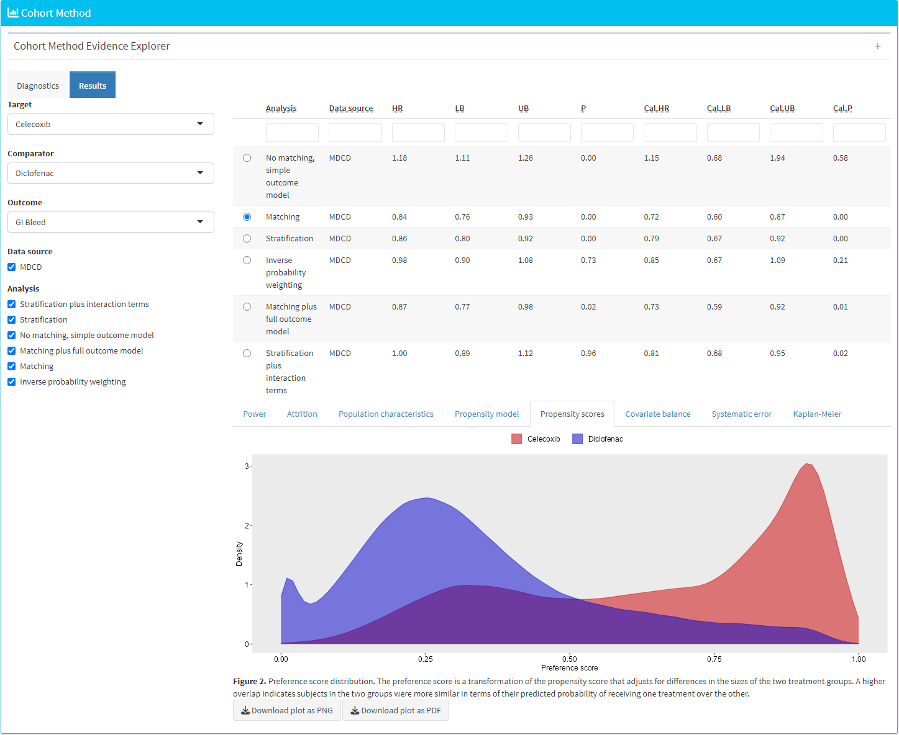

```{r, echo = FALSE, message = FALSE, warning = FALSE}
library(CohortMethod)
outputFolder <- "d:/temp/cohortMethodVignette2_arrow"
folderExists <- dir.exists(outputFolder)
```
# Introduction

In this vignette we focus on running several different analyses on several target-comparator-outcome combinations. This can be useful when we want to explore the sensitivity to analyses choices, include controls, or run an experiment similar to the OMOP experiment to empirically identify the optimal analysis choices for a particular research question.

This vignette assumes you are already familiar with the `CohortMethod` package and are able to perform single studies. We will walk through all the steps needed to perform an exemplar set of analyses, and we have selected the well-studied topic of the effect of coxibs versus non-selective nonsteroidal anti-inflammatory drugs (NSAIDs) on gastrointestinal (GI) bleeding-related hospitalization. For simplicity, we focus on one coxib -- celecoxib -- and one non-selective NSAID -- diclofenac. We will execute various variations of an analysis for the primary outcome and a large set of negative control outcomes.

# General approach

The general approach to running a set of analyses is that you specify all the function arguments of the functions you would normally call, and create sets of these function arguments. The final outcome models as well as intermediate data objects will all be saved to disk for later extraction. 

An analysis will be executed by calling these functions in sequence:

1. `getDbCohortMethodData()`
2. `createStudyPopulation()`
2. `createPs()` (optional)
3. `trimByPs()` or `trimByPsToEquipoise()` (optional)
4. `matchOnPs()`, `matchOnPsAndCovariates()`, `stratifyByPs()`, or `stratifyByPsAndCovariates()` (optional)
5. `computeCovariateBalance()` (optional)
5. `fitOutcomeModel()` (optional)

When you provide several analyses to the `CohortMethod` package, it will determine whether any of the analyses have anything in common, and will take advantage of this fact. For example, if we specify several analyses that only differ in the way the outcome model is fitted, then `CohortMethod` will extract the data and fit the propensity model only once, and re-use this in all the analyses. 

The function arguments you need to define have been divided into four groups:

1. **Hypothesis of interest**: arguments that are specific to a hypothesis of interest, in the case of the cohort method this is a combination of target, comparator, and outcome.
2. **Analyses**: arguments that are not directly specific to a hypothesis of interest, such as the washout window, whether to include drugs as covariates, etc.
3. Arguments that are the output of a previous function in the `CohortMethod` package, such as the `cohortMethodData` argument of the `createPs` function. These cannot be specified by the user.
4. Arguments that are specific to an environment, such as the connection details for connecting to the server, and the name of the schema holding the CDM data.

There are a two arguments (`excludedCovariateConceptIds`, and `includedCovariateConceptIds` of the `getDbCohortMethodData()` function) that can be argued to be part both of group 1 and 2. These arguments are therefore present in both groups, and when executing the analysis the union of the two lists of concept IDs will be used.

# Preparation for the example

We need to tell R how to connect to the server where the data are. `CohortMethod` uses the `DatabaseConnector` package, which provides the `createConnectionDetails` function. Type `?createConnectionDetails` for the specific settings required for the various database management systems (DBMS). For example, one might connect to a PostgreSQL database using this code:

```{r eval=FALSE}
connectionDetails <- createConnectionDetails(dbms = "postgresql", 
                                             server = "localhost/ohdsi", 
                                             user = "joe", 
                                             password = "supersecret")

cdmDatabaseSchema <- "my_cdm_data"
resultsDatabaseSchema <- "my_results"
options(sqlRenderTempEmulationSchema = NULL)
outputFolder <- "./CohortMethodOutput"
```

The last three lines define the `cdmDatabaseSchema`, `resultSchema`, and `outputFolder` variables. We'll use these later to tell R where the data in CDM format live,  where we want to write intermediate tables, and where the intermediate and output files should be stored in the local file system. Note that for Microsoft SQL Server, databaseschemas need to specify both the database and the schema, so for example `cdmDatabaseSchema <- "my_cdm_data.dbo"`.

We also need to prepare our exposures and outcomes of interest. The drug_era table in the OMOP Common Data Model already contains prespecified cohorts of users at the ingredient level, so we will use that for the exposures. For the outcomes, we want to restrict our analysis only to those outcomes that are recorded in an inpatient setting, so we will need to create a custom cohort table. For this example, we want to include GI bleed (concept ID 192671) as well as a set of 35 negative controls. Negative controls are defined as those outcomes where there is no evidence that either the target drug (celexocib) or comparator drug (diclofenac) causes the outcome. 

We create a text file called *VignetteOutcomes.sql* with the following content:

```sql
/***********************************
File VignetteOutcomes.sql
***********************************/
DROP TABLE IF EXISTS @resultsDatabaseSchema.outcomes;

SELECT ancestor_concept_id AS cohort_definition_id,
	condition_start_date AS cohort_start_date,
	condition_end_date AS cohort_end_date,
	condition_occurrence.person_id AS subject_id
INTO @resultsDatabaseSchema.outcomes
FROM @cdmDatabaseSchema.condition_occurrence
INNER JOIN @cdmDatabaseSchema.visit_occurrence
	ON condition_occurrence.visit_occurrence_id = visit_occurrence.visit_occurrence_id
INNER JOIN @cdmDatabaseSchema.concept_ancestor
	ON condition_concept_id = descendant_concept_id
WHERE ancestor_concept_id IN (192671, 24609, 29735, 73754, 80004, 134718, 139099,
141932, 192367, 193739, 194997, 197236, 199074, 255573, 257007, 313459, 314658,
316084, 319843, 321596, 374366, 375292, 380094, 433753, 433811, 436665, 436676,
436940, 437784, 438134, 440358, 440374, 443617, 443800, 4084966, 4288310)
	AND visit_occurrence.visit_concept_id IN (9201, 9203);
```
This is parameterized SQL which can be used by the `SqlRender` package. We use parameterized SQL so we do not have to pre-specify the names of the CDM and result schemas. That way, if we want to run the SQL on a different schema, we only need to change the parameter values; we do not have to change the SQL code. By also making use of translation functionality in `SqlRender`, we can make sure the SQL code can be run in many different environments.

```{r eval=FALSE}
library(SqlRender)
sql <- readSql("VignetteOutcomes.sql")
sql <- render(sql,
              cdmDatabaseSchema = cdmDatabaseSchema, 
              resultsDatabaseSchema = resultsDatabaseSchema)
sql <- translate(sql, targetDialect = connectionDetails$dbms)

connection <- connect(connectionDetails)
executeSql(connection, sql)
```

In this code, we first read the SQL from the file into memory. In the next line, we replace the two parameter names with the actual values. We then translate the SQL into the dialect appropriate for the DBMS we already specified in the `connectionDetails`. Next, we connect to the server, and submit the rendered and translated SQL.

# Specifying hypotheses of interest

The first group of arguments define the target, comparator, and outcome. Here we demonstrate how to create one set, and add that set to a list:

```{r eval=FALSE}
outcomeOfInterest <- createOutcome(outcomeId = 192671,
                                   outcomeOfInterest = TRUE)

negativeControlIds <- c(192671, 29735, 140673, 197494,
                        198185, 198199, 200528, 257315,
                        314658, 317376, 321319, 380731,
                        432661, 432867, 433516, 433701,
                        433753, 435140, 435459, 435524,
                        435783, 436665, 436676, 442619,
                        444252, 444429, 4131756, 4134120,
                        4134454, 4152280, 4165112, 4174262,
                        4182210, 4270490, 4286201, 4289933)

negativeControlOutcomes <- lapply(
  negativeControlIds,
  function(outcomeId) createOutcome(outcomeId = outcomeId,
                                    outcomeOfInterest = FALSE,
                                    trueEffectSize = 1)
)


tcos <- createTargetComparatorOutcomes(
  targetId = 1118084,
  comparatorId = 1124300,
  outcomes = append(list(outcomeOfInterest),
                    negativeControlOutcomes)
)

targetComparatorOutcomesList <- list(tcos)
```

We first define the outcome of interest (GI-bleed, concept ID 192671), explicitly stating this is an outcome of interest (`outcomeOfInterest = TRUE`), meaning we want the full set of artifacts generated for this outcome. We then create a set of negative control outcomes. Because we specify `outcomeOfInterest = FALSE`, many of the artifacts will not be saved (like the matched population), or even not generated at all (like the covariate balance). This can save a lot of compute time and disk space. We also provide the true effect size for these controls, which will be used later for empirical calibration. We set the target to be celecoxib (concept ID 1118084), and the comparator to be diclofenac (concept ID 1124300).

A convenient way to save `targetComparatorOutcomesList` to file is by using the `saveTargetComparatorOutcomesList` function, and we can load it again using the `loadTargetComparatorOutcomesList` function.

# Specifying analyses

The second group of arguments are not specific to a hypothesis of interest, and comprise the majority of arguments. For each function that will be called during the execution of the analyses, a companion function is available that has (almost) the same arguments. For example, for the `trimByPs()` function there is the `createTrimByPsArgs()` function. These companion functions can be used to create the arguments to be used during execution:

```{r eval=TRUE}
nsaids <- 21603933

covarSettings <- createDefaultCovariateSettings(
  excludedCovariateConceptIds = nsaids,
  addDescendantsToExclude = TRUE
)

getDbCmDataArgs <- createGetDbCohortMethodDataArgs(
  washoutPeriod = 183,
  restrictToCommonPeriod = FALSE,
  firstExposureOnly = TRUE,
  removeDuplicateSubjects = "remove all",
  studyStartDate = "",
  studyEndDate = "",
  covariateSettings = covarSettings
)

createStudyPopArgs <- createCreateStudyPopulationArgs(
  removeSubjectsWithPriorOutcome = TRUE,
  minDaysAtRisk = 1,
  riskWindowStart = 0,
  startAnchor = "cohort start",
  riskWindowEnd = 30,
  endAnchor = "cohort end"
)

fitOutcomeModelArgs1 <- createFitOutcomeModelArgs(modelType = "cox")
```

Any argument that is not explicitly specified by the user will assume the default value specified in the function. We can now combine the arguments for the various functions into a single analysis:

```{r eval=TRUE}
cmAnalysis1 <- createCmAnalysis(
  analysisId = 1,
  description = "No matching, simple outcome model",
  getDbCohortMethodDataArgs = getDbCmDataArgs,
  createStudyPopArgs = createStudyPopArgs,
  fitOutcomeModelArgs = fitOutcomeModelArgs1
)
```

Note that we have assigned an analysis ID (1) to this set of arguments. We can use this later to link the results back to this specific set of choices. We also include a short description of the analysis.

We can easily create more analyses, for example by using matching, stratification, inverse probability of treatment weighting, or by using more sophisticated outcome models:

```{r eval=TRUE}
createPsArgs <- createCreatePsArgs() # Use default settings only

matchOnPsArgs <- createMatchOnPsArgs(maxRatio = 100)

computeSharedCovBalArgs <- createComputeCovariateBalanceArgs()

computeCovBalArgs <- createComputeCovariateBalanceArgs(
  covariateFilter = getDefaultCmTable1Specifications()
)

fitOutcomeModelArgs2 <- createFitOutcomeModelArgs(
  modelType = "cox",
  stratified = TRUE
)

cmAnalysis2 <- createCmAnalysis(
  analysisId = 2,
  description = "Matching",
  getDbCohortMethodDataArgs = getDbCmDataArgs,
  createStudyPopArgs = createStudyPopArgs,
  createPsArgs = createPsArgs,
  matchOnPsArgs = matchOnPsArgs,
  computeSharedCovariateBalanceArgs = computeSharedCovBalArgs,
  computeCovariateBalanceArgs = computeCovBalArgs,
  fitOutcomeModelArgs = fitOutcomeModelArgs2
)

stratifyByPsArgs <- createStratifyByPsArgs(numberOfStrata = 5)

cmAnalysis3 <- createCmAnalysis(
  analysisId = 3,
  description = "Stratification",
  getDbCohortMethodDataArgs = getDbCmDataArgs,
  createStudyPopArgs = createStudyPopArgs,
  createPsArgs = createPsArgs,
  stratifyByPsArgs = stratifyByPsArgs,
  computeSharedCovariateBalanceArgs = computeSharedCovBalArgs,
  computeCovariateBalanceArgs = computeCovBalArgs,
  fitOutcomeModelArgs = fitOutcomeModelArgs2
)

fitOutcomeModelArgs3 <- createFitOutcomeModelArgs(
  modelType = "cox",
  inversePtWeighting = TRUE
)

cmAnalysis4 <- createCmAnalysis(
  analysisId = 4,
  description = "Inverse probability weighting",
  getDbCohortMethodDataArgs = getDbCmDataArgs,
  createStudyPopArgs = createStudyPopArgs,
  createPsArgs = createPsArgs,
  fitOutcomeModelArgs = fitOutcomeModelArgs3
)

fitOutcomeModelArgs4 <- createFitOutcomeModelArgs(
  useCovariates = TRUE,
  modelType = "cox",
  stratified = TRUE
)

cmAnalysis5 <- createCmAnalysis(
  analysisId = 5,
  description = "Matching plus full outcome model",
  getDbCohortMethodDataArgs = getDbCmDataArgs,
  createStudyPopArgs = createStudyPopArgs,
  createPsArgs = createPsArgs,
  matchOnPsArgs = matchOnPsArgs,
  fitOutcomeModelArgs = fitOutcomeModelArgs4
)

interactionCovariateIds <- c(8532001, 201826210, 21600960413) # Female, T2DM, concurent use of antithrombotic agents

fitOutcomeModelArgs5 <- createFitOutcomeModelArgs(
  modelType = "cox",
  stratified = TRUE,
  interactionCovariateIds = interactionCovariateIds
)

cmAnalysis6 <- createCmAnalysis(
  analysisId = 6,
  description = "Stratification plus interaction terms",
  getDbCohortMethodDataArgs = getDbCmDataArgs,
  createStudyPopArgs = createStudyPopArgs,
  createPsArgs = createPsArgs,
  stratifyByPsArgs = stratifyByPsArgs,
  fitOutcomeModelArgs = fitOutcomeModelArgs5
)
```

These analyses can be combined in a list:

```{r eval=TRUE}
cmAnalysisList <- list(cmAnalysis1, 
                       cmAnalysis2, 
                       cmAnalysis3, 
                       cmAnalysis4, 
                       cmAnalysis5, 
                       cmAnalysis6)
```

A convenient way to save `cmAnalysisList` to file is by using the `saveCmAnalysisList` function, and we can load it again using the `loadCmAnalysisList` function.

## Covariate balance

In our code, we specified that covariate balance must be computed for some of our analysis. For computational reasons, covariate balance has been split into two: We can compute covariate balance for each target-comparator-outcome-analysis combination, and we can compute covariate balance for each target-comparator-analysis, so across all outcomes. The latter is referred to as 'shared covariate balance'. Since there can be many outcomes, it is often not feasible to recompute (or store) balance for all covariates for each outcome. Moreover, the differences between study populations for the various outcomes are likely very small; the only differences will arise from removing those having the outcome prior, which will exclude different people from the study population depending on the outcome. We therefore typically compute the balance for all covariates across all outcomes (shared balance), and only for a small subset of covariates for each outcome. In the code above, we use all covariates for the shared balance computation, which we typically use to evaluate whether our analysis achieved covariate balance. We limit the covariates for the per-outcome balance computations to only those used for the standard 'table 1' definition used in the `getDefaultCmTable1Specifications()` function, which we can use to create a 'table 1' for each outcome. 

# Executing multiple analyses

We can now run the analyses against the hypotheses of interest using the `runCmAnalyses()` function. This function will run all specified analyses against all hypotheses of interest, meaning that the total number of outcome models is `length(cmAnalysisList) * length(targetComparatorOutcomesList)` (if all analyses specify an outcome model should be fitted). Note that we do not want all combinations of analyses and hypothesis to be computed, we can can skip certain analyses by using the `analysesToExclude` argument of the `runCmAnalyses()`.

```{r eval=FALSE}
multiThreadingSettings <- createDefaultMultiThreadingSettings(parallel::detectCores())

result <- runCmAnalyses(
  connectionDetails = connectionDetails,
  cdmDatabaseSchema = cdmDatabaseSchema,
  exposureDatabaseSchema = cdmDatabaseSchema,
  exposureTable = "drug_era",
  outcomeDatabaseSchema = resultsDatabaseSchema,
  outcomeTable = "outcomes",
  outputFolder = folder,
  cdmVersion = cdmVersion,
  cmAnalysisList = cmAnalysisList,
  targetComparatorOutcomesList = targetComparatorOutcomesList,
  multiThreadingSettings = multiThreadingSettings
)
```

In the code above, we first specify how many parallel threads `CohortMethod` can use. Many of the computations can be computed in parallel, and providing more than one CPU core can greatly speed up the computation. Here we specify `CohortMethod` can use all the CPU cores detected in the system (using the `parallel::detectCores()` function). 

We call `runCmAnalyses()`, providing the arguments for connecting to the database, which schemas and tables to use, as well as the analyses and hypotheses of interest. The `outputFolder` specifies where the outcome models and intermediate files will be written. 

## Restarting

If for some reason the execution was interrupted, you can restart by re-issuing the `runCmAnalyses()` command. Any intermediate and final products that have already been completed and written to disk will be skipped.

# Retrieving the results

The result of the `runCmAnalyses()` is a data frame with one row per target-target-outcome-analysis combination. It provides the file names of the intermediate and end-result files that were constructed. For example, we can retrieve and plot the propensity scores for the combination of our target, comparator, outcome of interest, and last analysis:

```{r eval=FALSE}
psFile <- result$psFile[result$targetId == 1118084 & 
                        result$comparatorId == 1124300 & 
                        result$outcomeId == 192671 &
                        result$analysisId == 5]
ps <- readRDS(file.path(outputFolder, psFile))
plotPs(ps)
```
```{r echo=FALSE,message=FALSE}
if (folderExists) {
  result <- readRDS(file.path(outputFolder, "outcomeModelReference.rds"))
  psFile <- result$psFile[result$targetId == 1118084 & 
                            result$comparatorId == 1124300 & 
                            result$outcomeId == 192671 &
                            result$analysisId == 5]
  ps <- readRDS(file.path(outputFolder, psFile))
  plotPs(ps)
}
```

Note that some of the file names will appear several times in the table. For example, analysis 3 and 5 only differ in terms of the outcome model, and will share the same propensity score and stratification files.

We can always retrieve the file reference table again using the `getFileReference()` function:
```{r eval=FALSE}
result <- getFileReference(folder)
```

We can get a summary of the results using `getResultsSummary()`:
```{r eval=FALSE}
resultsSum <- getResultsSummary(outputFolder)
head(resultsSum)
```
```{r echo=FALSE,message=FALSE}
if (folderExists) {
  resultsSum <- readRDS(file.path(outputFolder, "resultsSummary.rds"))
  head(resultsSum)
}
```

This tells us, per target-comparator-outcome-analysis combination, the estimated relative risk and 95% confidence interval, as well as the number of people in the treated and comparator group (after trimming and matching if applicable), and the number of outcomes observed for those groups within the specified risk windows.

## Empirical calibration and negative control distribution

Because our study included negative control outcomes, our analysis summary also contains calibrated confidence intervals and p-values. We can also create the calibration effect plots for every analysis ID. In each plot, the blue dots represent our negative control outcomes, and the yellow diamond represents our health outcome of interest: GI bleed. An unbiased, well-calibrated analysis should have 95% of the negative controls between the dashed lines (ie. 95% should have p > .05).

```{r eval=FALSE}
install.packages("EmpiricalCalibration")
library(EmpiricalCalibration)

# Analysis 1: No matching, simple outcome model
negCons <- resultsSum[resultsSum$analysisId == 1 & resultsSum$outcomeId != 192671, ]
hoi <-  resultsSum[resultsSum$analysisId == 1 & resultsSum$outcomeId == 192671, ]
null <- fitNull(negCons$logRr, negCons$seLogRr)
plotCalibrationEffect(negCons$logRr, negCons$seLogRr, hoi$logRr, hoi$seLogRr, null)
```
```{r echo=FALSE,message=FALSE,warning=FALSE,eval=TRUE}
if (folderExists) {
  library(EmpiricalCalibration)
  negCons <- resultsSum[resultsSum$analysisId == 1 & resultsSum$outcomeId != 192671, ]
  hoi <-  resultsSum[resultsSum$analysisId == 1 & resultsSum$outcomeId == 192671, ]
  null <- fitNull(negCons$logRr, negCons$seLogRr)
  plotCalibrationEffect(negCons$logRr, negCons$seLogRr, hoi$logRr, hoi$seLogRr, null)
}
```

```{r eval=FALSE}
# Analysis 2: Matching
negCons <- resultsSum[resultsSum$analysisId == 2 & resultsSum$outcomeId != 192671, ]
hoi <-  resultsSum[resultsSum$analysisId == 2 & resultsSum$outcomeId == 192671, ]
null <- fitNull(negCons$logRr, negCons$seLogRr)
plotCalibrationEffect(negCons$logRr, negCons$seLogRr, hoi$logRr, hoi$seLogRr, null)
```
```{r echo=FALSE,message=FALSE,warning=FALSE,eval=TRUE}
if (folderExists) {
  negCons <- resultsSum[resultsSum$analysisId == 2 & resultsSum$outcomeId != 192671, ]
  hoi <-  resultsSum[resultsSum$analysisId == 2 & resultsSum$outcomeId == 192671, ]
  null <- fitNull(negCons$logRr, negCons$seLogRr)
  plotCalibrationEffect(negCons$logRr, negCons$seLogRr, hoi$logRr, hoi$seLogRr, null)
}
```

```{r eval=FALSE}
# Analysis 3: Stratification
negCons <- resultsSum[resultsSum$analysisId == 3 & resultsSum$outcomeId != 192671, ]
hoi <-  resultsSum[resultsSum$analysisId == 3 & resultsSum$outcomeId == 192671, ]
null <- fitNull(negCons$logRr, negCons$seLogRr)
plotCalibrationEffect(negCons$logRr, negCons$seLogRr, hoi$logRr, hoi$seLogRr, null)
```
```{r echo=FALSE,message=FALSE,warning=FALSE,eval=TRUE}
if (folderExists) {
  negCons <- resultsSum[resultsSum$analysisId == 3 & resultsSum$outcomeId != 192671, ]
  hoi <-  resultsSum[resultsSum$analysisId == 3 & resultsSum$outcomeId == 192671, ]
  null <- fitNull(negCons$logRr, negCons$seLogRr)
  plotCalibrationEffect(negCons$logRr, negCons$seLogRr, hoi$logRr, hoi$seLogRr, null)
}
```

```{r eval=FALSE}
# Analysis 4: Inverse probability of treatment weighting
negCons <- resultsSum[resultsSum$analysisId == 4 & resultsSum$outcomeId != 192671, ]
hoi <-  resultsSum[resultsSum$analysisId == 4 & resultsSum$outcomeId == 192671, ]
null <- fitNull(negCons$logRr, negCons$seLogRr)
plotCalibrationEffect(negCons$logRr, negCons$seLogRr, hoi$logRr, hoi$seLogRr, null)
```
```{r echo=FALSE,message=FALSE,warning=FALSE,eval=TRUE}
if (folderExists) {
  negCons <- resultsSum[resultsSum$analysisId == 4 & resultsSum$outcomeId != 192671, ]
  hoi <-  resultsSum[resultsSum$analysisId == 4 & resultsSum$outcomeId == 192671, ]
  null <- fitNull(negCons$logRr, negCons$seLogRr)
  plotCalibrationEffect(negCons$logRr, negCons$seLogRr, hoi$logRr, hoi$seLogRr, null)
}
```

```{r eval=FALSE}
# Analysis 5: Stratification plus full outcome model
negCons <- resultsSum[resultsSum$analysisId == 5 & resultsSum$outcomeId != 192671, ]
hoi <-  resultsSum[resultsSum$analysisId == 5 & resultsSum$outcomeId == 192671, ]
null <- fitNull(negCons$logRr, negCons$seLogRr)
plotCalibrationEffect(negCons$logRr, negCons$seLogRr, hoi$logRr, hoi$seLogRr, null)
```
```{r echo=FALSE,message=FALSE,warning=FALSE,eval=TRUE}
if (folderExists) {
  negCons <- resultsSum[resultsSum$analysisId == 5 & resultsSum$outcomeId != 192671, ]
  hoi <-  resultsSum[resultsSum$analysisId == 5 & resultsSum$outcomeId == 192671, ]
  null <- fitNull(negCons$logRr, negCons$seLogRr)
  plotCalibrationEffect(negCons$logRr, negCons$seLogRr, hoi$logRr, hoi$seLogRr, null)
}
```

Analysis 6 explored interactions with certain variables. The estimates for these interaction terms are stored in a separate results summary. We can examine whether these estimates are also consistent with the null. In this example we consider the interaction with 'gender = female' (covariate ID 8532001): 


```{r eval=FALSE}
interactionResultsSum <- getInteractionResultsSummary(outputFolder)


# Analysis 6: Stratification plus interaction terms
negCons <- interactionResultsSum[interactionResultsSum$analysisId == 6 & interactionResultsSum$outcomeId != 192671, ]
hoi <-  interactionResultsSum[interactionResultsSum$analysisId == 6 & interactionResultsSum$outcomeId == 192671, ]
null <- fitNull(negCons$logRr, negCons$seLogRr)
plotCalibrationEffect(logRrNegatives = negCons$logRr, 
                      seLogRrNegatives = negCons$seLogRr, 
                      logRrPositives = hoi$logRr, 
                      seLogRrPositives = hoi$seLogRr, null)
```
```{r echo=FALSE,message=FALSE,eval=TRUE}
if (folderExists) {
  interactionResultsSum <- getInteractionResultsSummary(outputFolder)
  negCons <- interactionResultsSum[interactionResultsSum$analysisId == 6 & interactionResultsSum$outcomeId != 192671, ]
  hoi <-  interactionResultsSum[interactionResultsSum$analysisId == 6 & interactionResultsSum$outcomeId == 192671, ]
  null <- fitNull(negCons$logRr, negCons$seLogRr)
  plotCalibrationEffect(logRrNegatives = negCons$logRr, 
                        seLogRrNegatives = negCons$seLogRr, 
                        logRrPositives = hoi$logRr, 
                        seLogRrPositives = hoi$seLogRr, null)
}
```

# Exporting to CSV

The results generated so far all reside in binary object on your local file system, mixing aggregate statistics such as hazard ratios with patient-level data including propensity scores per person. How could we share our results with others, possibly outside our organization? This is where the `exportToCsv()` function comes in. This function exports all results, including diagnostics to CSV (comma-separated values) files. These files only contain aggregate statistics, not patient-level data. The format is CSV files to enable human review.

```{r eval=FALSE}
exportToCsv(
  outputFolder,
  exportFolder = file.path(folder, "export"),
  databaseId = "My CDM",
  minCellCount = 5,
  maxCores = parallel::detectCores()
)
```

Any person counts in the results that are smaller than the `minCellCount` argument will be blinded, by replacing the count with the negative `minCellCount`. For example, if the number of people with the outcome is 3, and `minCellCount = 5`, the count will be reported to be -5, which in the Shiny app will be displayed as '<5'. 

Information on the data model used to generate the CSV files can be retrieved using `getResultsDataModel()`:

```{r}
getResultsDataModel()
```

# View results in a Shiny app

Finally, we can view the results in a Shiny app. For this we must first load the CSV files produced by `exportToCsv()` into a database. We could use the `uploadExportedResults()` function for this. However, if we just want to view the results ourselves we can create a small SQLite database ourselves without having to set up a database server. In any case we need to specify the names of the exposure and outcome cohorts we used in our study. We can create the SQLite database using:

```{r eval=FALSE}
cohorts <- data.frame(
  cohortId = c(
    1118084,
    1124300,
    192671),
  cohortName = c(
    "Celecoxib",
    "Diclofenac",
    "GI Bleed"
  )
)

insertExportedResultsInSqlite(
  sqliteFileName = file.path(folder, "myResults.sqlite"), 
  exportFolder = file.path(folder, "export"), 
  cohorts = cohorts
)

```

Next we launch the Shiny app using:
```{r eval=FALSE}
launchResultsViewerUsingSqlite(
  sqliteFileName = file.path(folder, "myResults.sqlite")
)
```

```{r echo=FALSE, fig.cap="CohortMethod Shiny app", out.width = '80%'}

```

# Acknowledgments

Considerable work has been dedicated to provide the `CohortMethod` package.

```{r eval=TRUE}
citation("CohortMethod")
```

Further, `CohortMethod` makes extensive use of the `Cyclops` package.

```{r eval=TRUE}
citation("Cyclops")
```

This work is supported in part through the National Science Foundation grant IIS 1251151.
